# Tahoe MeshCore solar repeater

A [MeshCore](https://meshcore.co.uk) repeater that lives on a tree. A RAK4631 radio, a 15 Ah LiFePO4 cell and a small 5 V solar panel go in a 3D-printed enclosure that closes with a quarter turn.

I designed it for Lake Tahoe: 6,200 ft, snow on the roof for months at a time, and a long fire season. That drove most of the choices. The cell is LiFePO4 rather than lithium-ion. One charger is set up properly for it, with a temperature sensor and a fuse at the cell. Every opening is on the underside, and the roof sheds snow away from the tree.

<table>
<tr>
<td width="50%">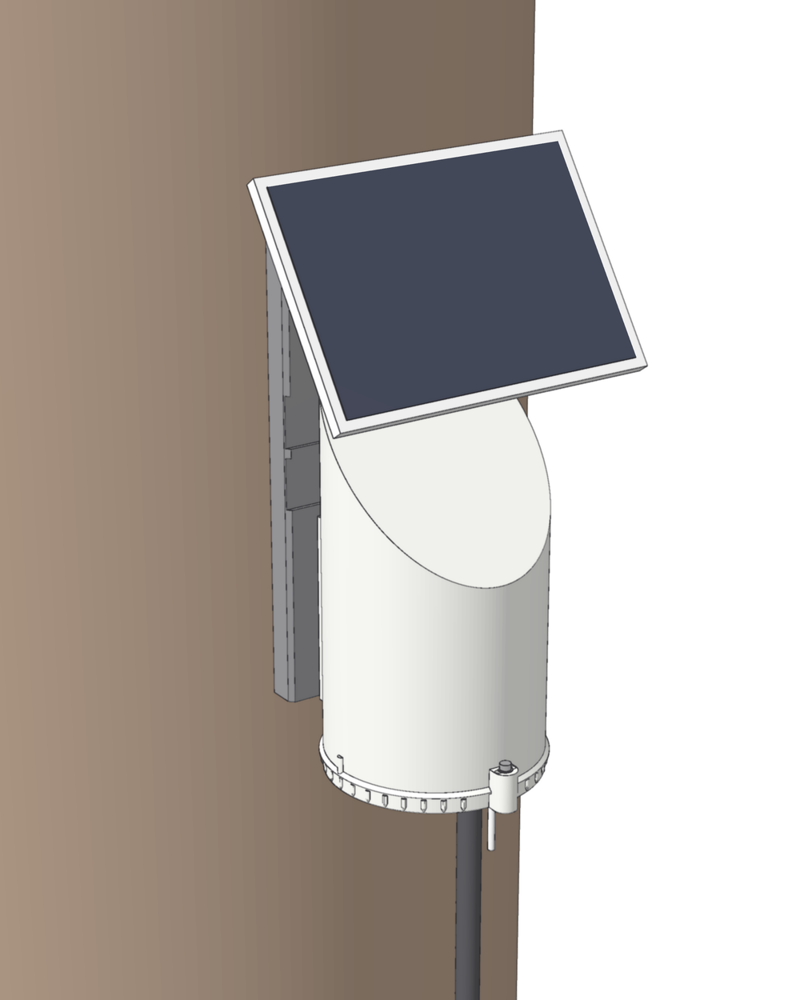</td>
<td width="50%">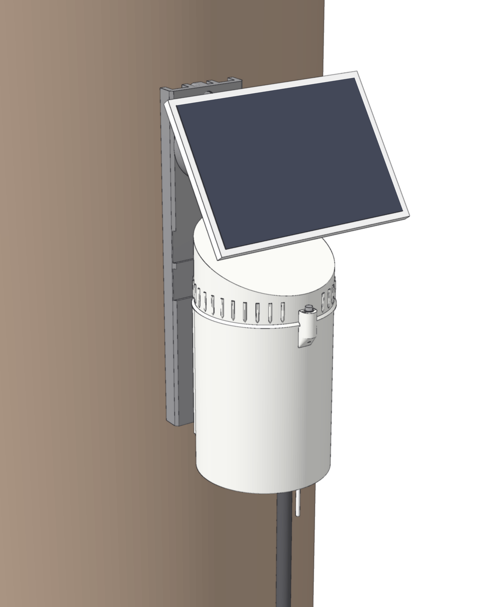</td>
</tr>
<tr>
<td valign="top"><b>Version A.</b> The top stays on the tree and the base screws up into it from below. Build this one for snow country.</td>
<td valign="top"><b>Version B.</b> A tall can stays on the tree and a short lid screws on top. It's easier to get into, but the joint is more exposed, so it's for milder weather.</td>
</tr>
</table>

> [!IMPORTANT]
> **Measure your panel mount before you print the bracket.** The brackets are drawn for a round mount whose three holes are 36 mm apart, center to center. If yours measures differently, change one number in the source and export the bracket again. [Changing the design](docs/customizing.md) shows how. The rest of the parts don't change.

## Pick a file

Each file holds every printed part for one combination:

- the top (A) or lid (B)
- the base (A) or can (B)
- the board sled
- the bracket
- two thread test rings
- a small fit-test bar
- for B with the wing-nut mount, three small spacers that go behind the bolt heads

Click a picture to open that file in GitHub's 3D viewer. To print one, load it in Bambu Studio, right-click it, choose **Split > To objects** and spread the parts over a few plates ([which parts go together](docs/build-guide.md#split-the-file-into-plates)). The [Printing](#printing) section below has times, filament and the pause heights.

<table>
<tr>
<th></th>
<th>Tree-screw mount</th>
<th>Bolt-on mount</th>
<th>Wing-nut mount</th>
</tr>
<tr>
<th>A</th>
<td align="center"><a href="stl/tahoe-repeater-A-tree-screw.stl">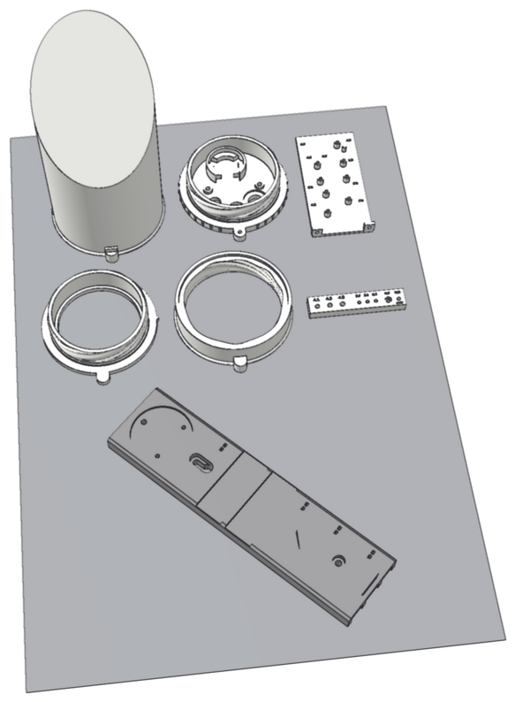</a> <a href="stl/tahoe-repeater-A-tree-screw.stl"><code>tahoe-repeater-A-tree-screw.stl</code></a></td>
<td align="center"> <a href="stl/tahoe-repeater-A-bolt-on.stl"><code>tahoe-repeater-A-bolt-on.stl</code></a></td>
<td align="center"> <a href="stl/tahoe-repeater-A-wing-nut.stl"><code>tahoe-repeater-A-wing-nut.stl</code></a></td>
</tr>
<tr>
<th>B</th>
<td align="center"><a href="stl/tahoe-repeater-B-tree-screw.stl">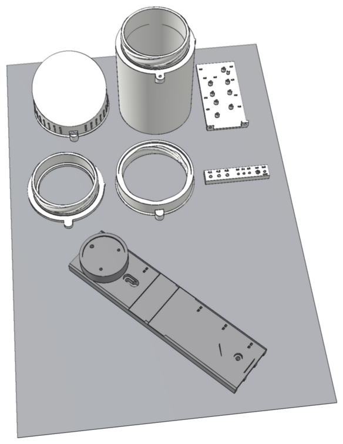</a> <a href="stl/tahoe-repeater-B-tree-screw.stl"><code>tahoe-repeater-B-tree-screw.stl</code></a></td>
<td align="center"><a href="stl/tahoe-repeater-B-bolt-on.stl">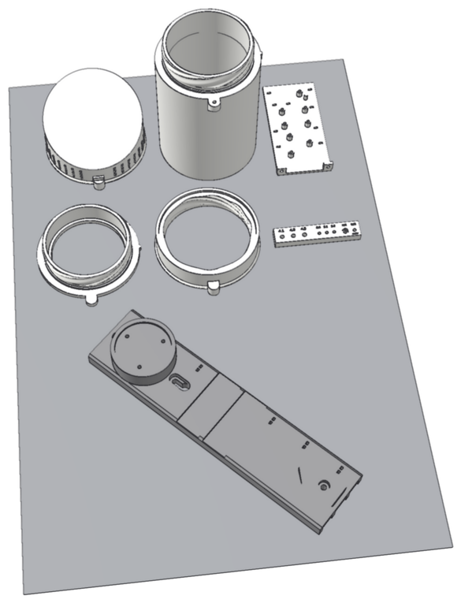</a> <a href="stl/tahoe-repeater-B-bolt-on.stl"><code>tahoe-repeater-B-bolt-on.stl</code></a></td>
<td align="center"><a href="stl/tahoe-repeater-B-wing-nut.stl">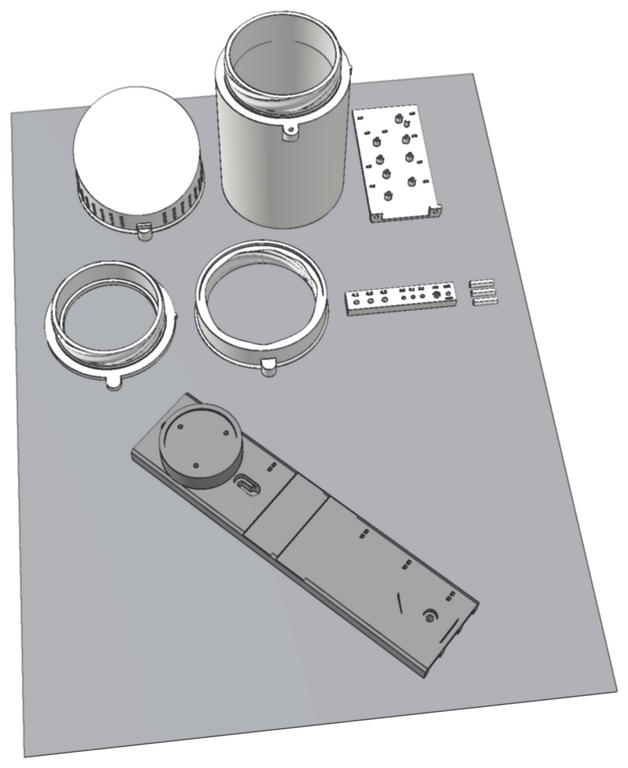</a> <a href="stl/tahoe-repeater-B-wing-nut.stl"><code>tahoe-repeater-B-wing-nut.stl</code></a></td>
</tr>
</table>

Not sure? Start with **A, tree-screw** on your own tree, or **A, bolt-on** if you'll use straps or you'd rather not put a screw through the panel mount.

| File | Why you'd pick it |
|---|---|
| A, tree-screw | Snow country. The panel mount's top screw goes into the tree, so taking the panel off means backing a screw out of the tree. Needs screws in the tree, not just straps. |
| A, bolt-on | Snow country, mounted with screws or straps. The panel mount bolts to the bracket with three sealed-in nuts, and the bracket has its own screw above the mount. |
| A, wing-nut | Snow country, on your own property where easy access matters more than tamper resistance. The panel comes off by hand with three wing nuts. |
| B, tree-screw | Milder weather, and you want to open it from the top. Panel secured into the tree as above. |
| B, bolt-on | Milder weather, screws or straps, panel bolted to the bracket. |
| B, wing-nut | Milder weather, on your own property, panel off by hand. |

## What every file has in common

**Enclosure**

- A round ASA enclosure, 109 mm across, with one joint and no holes in its walls or roof.
- A quarter-turn thread with 8 ridges of different widths, so it only goes together one way and the roof always slopes away from the tree. A small nub shows where to line up the tab before you turn it.
- One O-ring (AS568-153, EPDM). It sits in a groove on the lower part and presses sideways against a smooth bore in the upper part. The thread only holds the parts together, so it turns by hand and stops firmly when the rim meets the flange.
- A drip lip round the joint, so water running down the wall falls clear of it.
- One M3 lock screw, put in from the top so it can't fall out. It goes into a nut sealed inside the lower part during printing, so there's no loose nut to drop.
- Everything comes in through the floor, facing down: an M12 breather vent, a ¼" cable gland for the panel lead and an SMA bulkhead for the antenna.
- Inside, a sled holds the RAK19003 (with the RAK4631), the bq25185 charger and the 5 V boost board. There's room for a RAK1901 temperature and humidity sensor under the RAK board. A cup holds the 15 Ah cell upright behind the sled.

**Bracket**

- A dovetail rail that the enclosure slides down onto.
- Three tree screws in one line down the middle: one inside the rail, one in a keyhole just below the panel mount, and one at the top. Having them all in one line should make it easy to make adapters for posts or poles later.
- The keyhole lets you hang the bracket on one screw before you drive the rest. That screw's head sits in a recess, and the screw inside the rail is hidden once the enclosure is on.
- Two recessed channels across the front for 1" straps, behind the enclosure where they don't show. With straps across the front, the whole bracket sits between the strap and the tree.
- Zip-tie slots down one side for the panel cable.
- The panel's round mount sits flat in a pocket. Its screws go into hex nuts sealed inside the bracket, or through bolts held in the bracket. None of them thread into plastic.

**Printing**

- ASA, and no supports except inside B's lid.
- Two thread test rings and a fit-test bar, so you can check the thread, the O-ring and your inserts and nuts before the long prints.

## What's different

### Version A: fixed top

The top slides down the bracket's rail and stays there. Once the panel mount is on above it, the top can't be lifted off the rail. The base carries the cell, the boards and all three openings. It screws up into the top from below. To open it, take out the lock screw, turn the base a quarter turn and lower it straight down.

- The joint is at the very bottom of the box. The drip lip throws water running down the walls clear of it, and there's nowhere above it for snow to sit, unlike the joint under B's lid.
- The roof is a single 45° slope, high at the tree, so snow slides off to the front.
- Service happens with the base in your hands, below the box. The top, bracket and panel stay put.

### Version B: fixed can, screw-on lid

The can slides down a shorter rail and holds everything. The lid is short, with a 20° roof. To open it, take out the lock screw, turn the lid a quarter turn, lift it about a centimetre and slide it out sideways.

- You can look inside and work on it without taking anything down.
- The joint sits near the top, just under a shallow lid where snow can sit and melt, so it sees a lot more water. That's why B is the milder-weather option.
- The panel mount stands out 20 mm on a raised pad so the panel clears the lid coming off. That works with the panel tilted up to about 62°.
- The lid needs supports inside when you print it. Use tree supports, build plate only.
- With the lid off, the can lifts off its rail underneath the panel arm.

### Tree-screw mount

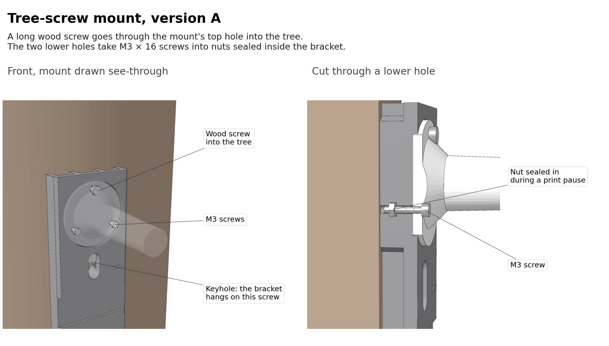

The mount's top hole takes a long wood screw straight through the bracket into the tree, and that doubles as the bracket's top screw. The two lower holes take M3 × 16 screws into hex nuts sealed inside the bracket. It's the most tamper-resistant of the three, but it needs a screw in the tree, so you can't hang it on straps alone.

### Bolt-on mount

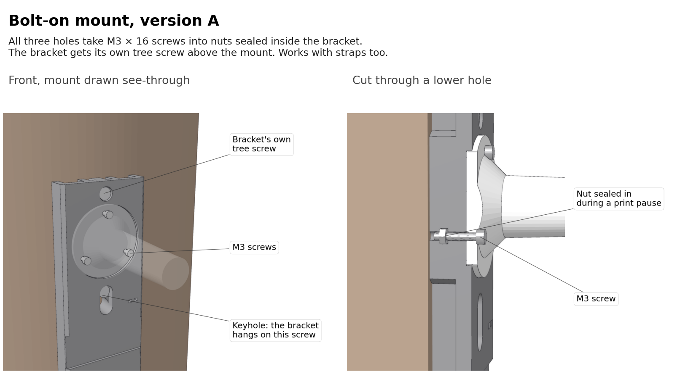

All three holes take M3 × 16 screws into nuts sealed inside the bracket, so the panel mount doesn't depend on the tree at all. The bracket gets its own screw hole above the mount instead. Use it when the bracket will hang on straps, or if you just don't want a screw through the mount.

### Wing-nut mount

Three M3 × 25 hex bolts drop into hex pockets on the back of the bracket, with their threads sticking out the front. The mount goes over them and three wing nuts hold it, so you can take the panel off by hand. The bolt heads are trapped between the bracket and the tree. On B, whose pad stands further out, a small printed spacer goes in behind each head. The bracket has its own top screw like the bolt-on. It's meant for private property where you want easy access and aren't worried about other people.

B's brackets have the same three mount styles on the raised pad: [B tree-screw](images/mount-B-tree.png), [B bolt-on](images/mount-B-bolt.png), [B wing-nut](images/mount-B-wing.png).

## Opening it up

<table>
<tr>
<td width="50%">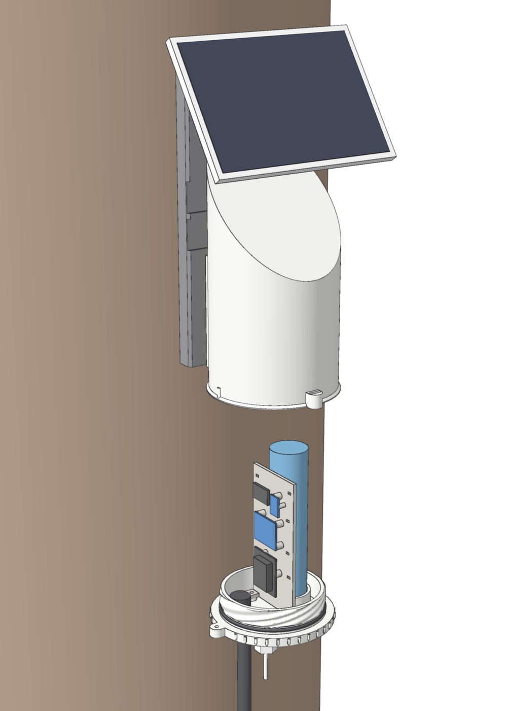</td>
<td width="50%">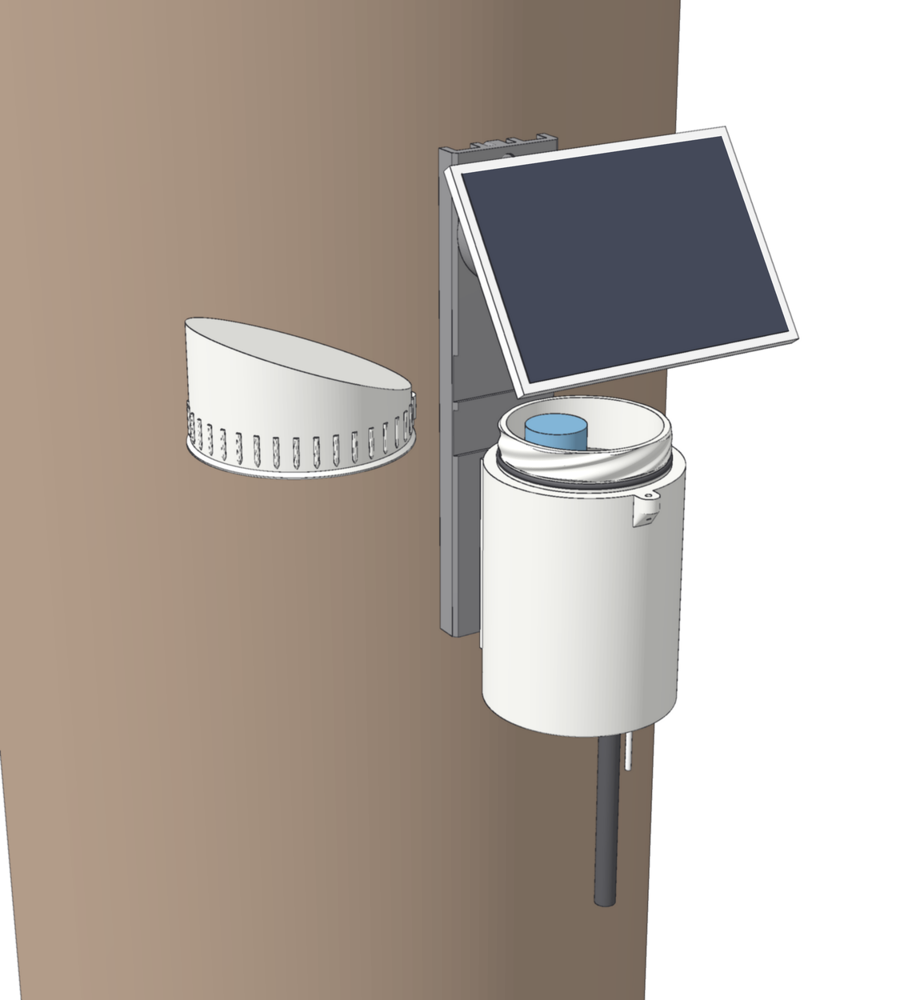</td>
</tr>
<tr>
<td valign="top"><b>A:</b> lock screw out, turn the base a quarter turn, lower it. The cell, boards and sled all come down with it. The panel cable stays connected, so leave some slack in it.</td>
<td valign="top"><b>B:</b> lock screw out, turn the lid a quarter turn, lift it a little and slide it out to the side.</td>
</tr>
</table>

## How it seals

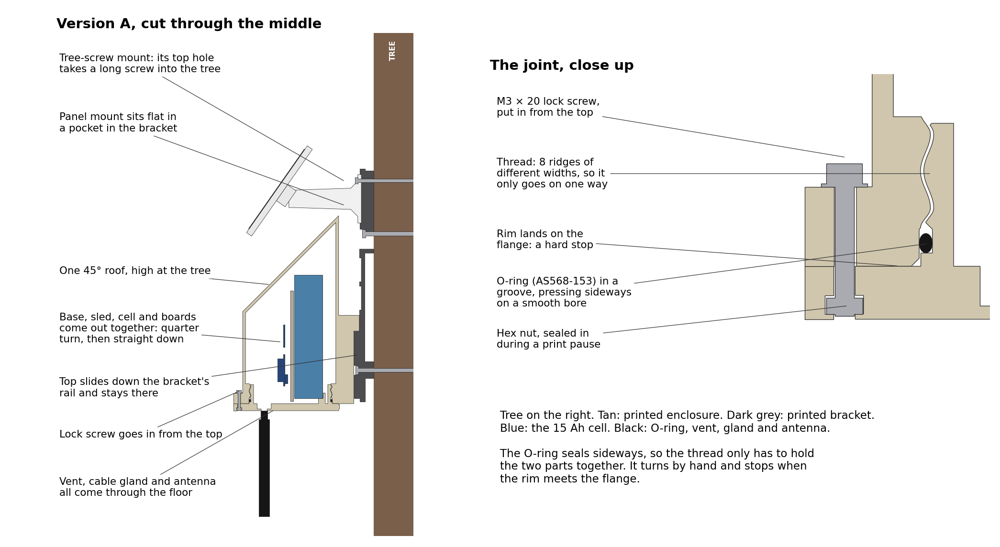

[Version B's cross-section](images/section-B.png) uses the same joint, higher up.

## Printing

Settings: ASA, 0.4 mm nozzle, 0.2 mm layers, 7 walls, 30% gyroid infill, 5 top and 5 bottom layers, with the enclosure door closed. The pause heights below assume 0.2 mm layers, including the first one.

| Part | Time | Filament | Notes |
|---|---|---|---|
| Thread test rings (pair) | 3 h 15 m | 100 g | Print first |
| Fit-test bar | 40 m | 13 g | Print first |
| A top | 8 h 15 m | 288 g | |
| A base | 2 h 55 m | 73 g | **Pause at 3.8 mm** for the lock nut |
| B can | 9 h 15 m | 293 g | **Pause at 133.8 mm** for the lock nut |
| B lid | 6 h 5 m | 137 g | Supports inside (tree, build plate only) |
| Sled | 1 h | 22 g | |
| Bracket A | 5 h 10 m to 5 h 30 m | 142 to 148 g | **Pause at 7.2 mm** for the nuts (tree-screw, bolt-on) |
| Bracket B | 6 h 45 m to 7 h 5 m | 175 to 182 g | **Pause at 27.2 mm** for the nuts (tree-screw, bolt-on) |

The wing-nut brackets don't need a pause. The times are PrusaSlicer estimates; Bambu Studio on a P1S will give you its own. A full version A comes to about 530 g and 17½ hours, and B to about 630 g and 23½ hours, plus the test pieces. One 1 kg spool covers either.

The [build guide](docs/build-guide.md#2-print-the-parts) shows how to add the pauses and how to drop the nuts in.

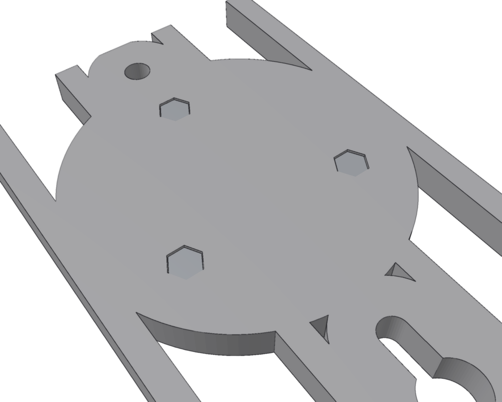 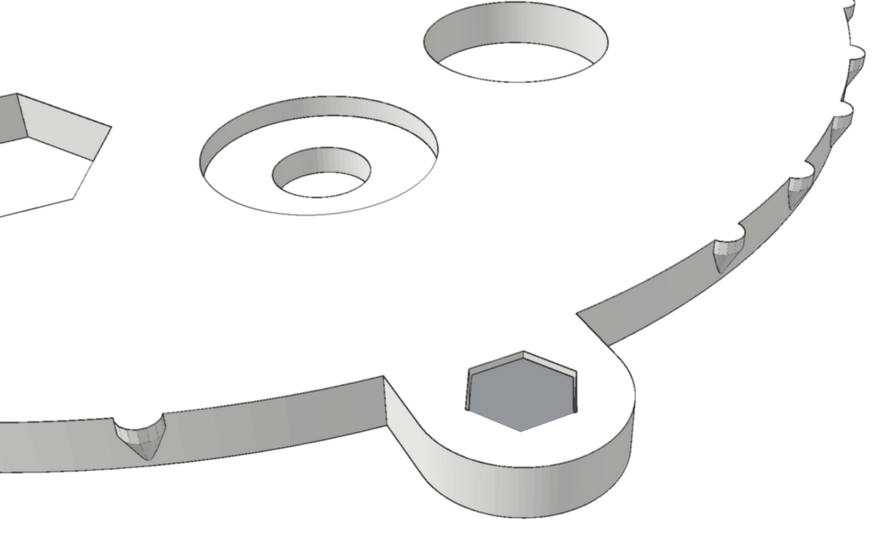

## Docs

- **[Parts list](docs/parts-list.md)**: everything to buy, as a checklist, with what each part is for.
- **[Build guide](docs/build-guide.md)**: printing, the electronics, assembly, mounting it on the tree, flashing MeshCore, service and troubleshooting.
- **[Changing the design](docs/customizing.md)**: the settings worth knowing about in the OpenSCAD source, such as the panel mount's hole spacing, and how to export new STLs.

The source is [`cad/tahoe-repeater.scad`](cad/tahoe-repeater.scad) (OpenSCAD 2021.01 or newer).

## License

[CC BY-NC-SA 4.0](https://creativecommons.org/licenses/by-nc-sa/4.0/). You're welcome to build it, change it and share it for non-commercial use, as long as you give credit and share your changes under the same license. Selling prints, kits or finished units, or using the design in a paid product or service, needs my written permission first. Open an issue to ask. The full terms are in [LICENSE](LICENSE).
