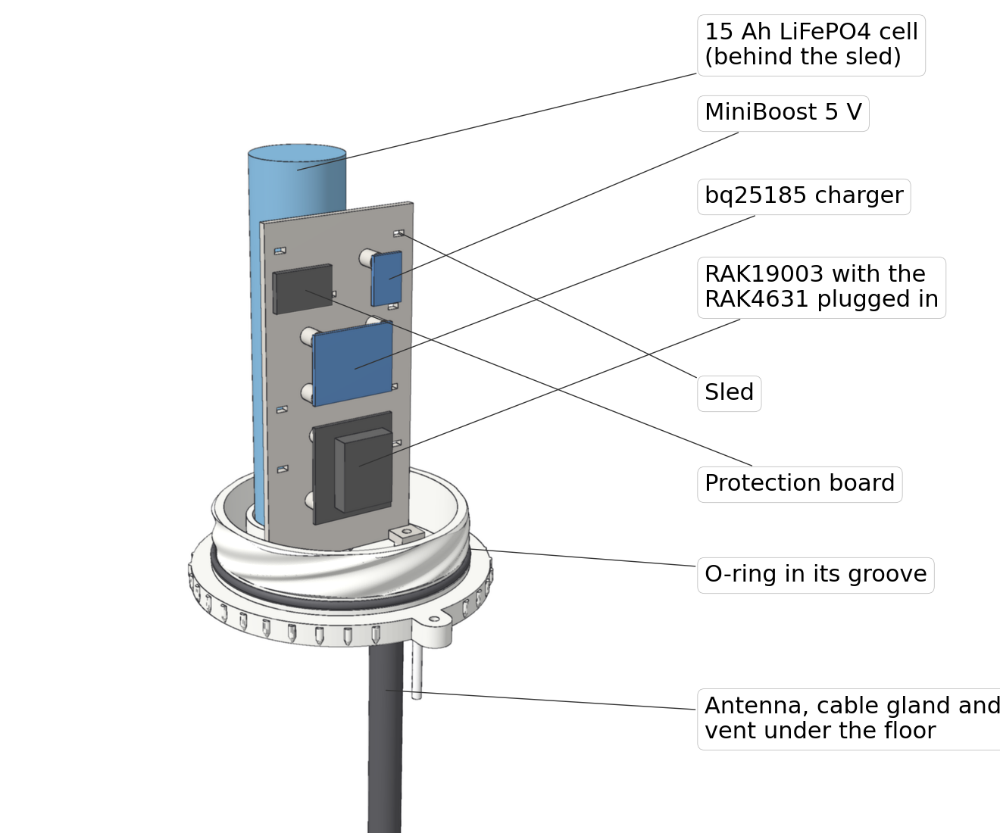
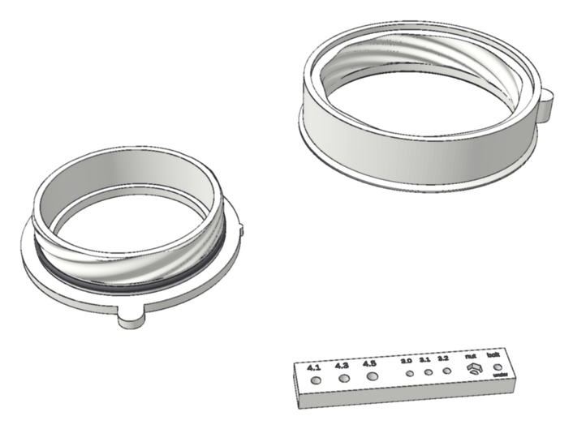
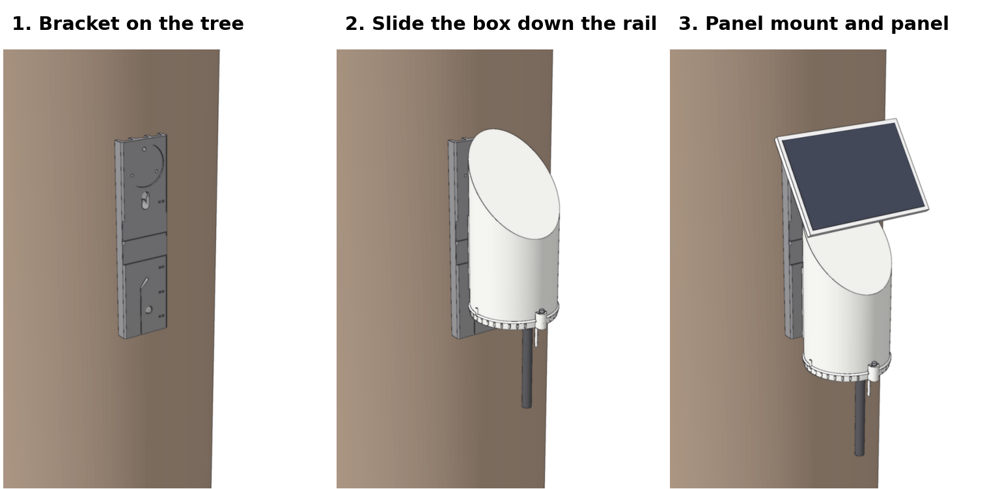
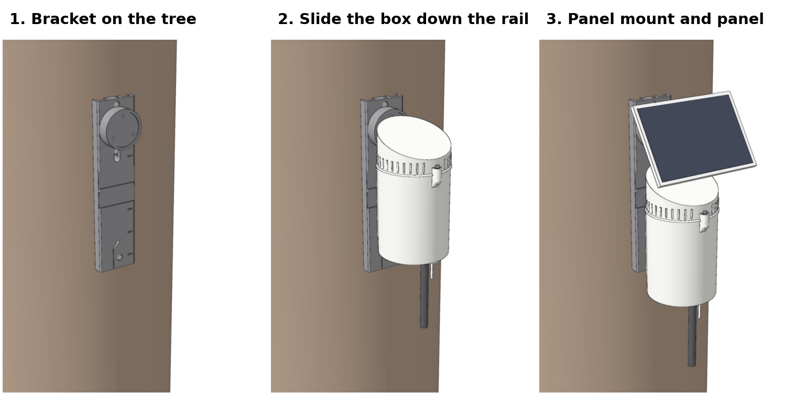

# Build guide

This is the whole build, start to finish, in the order I'd do it. Read it through once before you start. Several steps depend on things you did earlier, and the battery steps need care.

Everything here applies to both versions. Where A and B differ, it says so. **A** has a fixed top and a base that screws up into it. **B** has a fixed can and a lid that screws on top.

- [1. Before you start](#1-before-you-start)
- [2. Print the parts](#2-print-the-parts)
- [3. Check the fit](#3-check-the-fit)
- [4. Set up the charger](#4-set-up-the-charger)
- [5. Build the cell harness](#5-build-the-cell-harness)
- [6. Test the cold cutoff](#6-test-the-cold-cutoff)
- [7. Fit out the floor](#7-fit-out-the-floor)
- [8. Bring in the panel cable](#8-bring-in-the-panel-cable)
- [9. Hose-test the empty enclosure](#9-hose-test-the-empty-enclosure)
- [10. Build up the sled](#10-build-up-the-sled)
- [11. Put it all in](#11-put-it-all-in)
- [12. Flash MeshCore](#12-flash-meshcore)
- [13. Bench-test it for a day](#13-bench-test-it-for-a-day)
- [14. Close it up](#14-close-it-up)
- [15. Mount it](#15-mount-it)
- [16. Opening it later](#16-opening-it-later)
- [17. Troubleshooting](#17-troubleshooting)
- [Why it's hard to set on fire](#why-its-hard-to-set-on-fire)
- [Power budget](#power-budget)

## 1. Before you start

1. **Pick your file.** The [README](../README.md#pick-a-file) explains the six. If you're at altitude or in snow country, build A.
2. **Measure your panel mount.** Take the round mount off the panel and measure between the centers of two of its three screw holes. The brackets are drawn for 36 mm. If yours is different, follow [Changing the design](customizing.md) to export a bracket that matches before you print it. While you have it out, measure how thick the mount's base is at the holes. M3 × 16 screws suit a base up to 6 mm thick; from 6 to 10 mm, use M3 × 20.
3. **Get the parts together.** The [parts list](parts-list.md) is a checklist.
4. **Respect the cell.** A 15 Ah cell can push well over 100 A into a short. Keep its tabs covered whenever you're not working on them, don't let tools bridge them, and fit the fuse before anything else touches it.

## 2. Print the parts

### Settings

ASA, 0.4 mm nozzle, 0.2 mm layers (first layer 0.2 mm too), 7 walls, 30% gyroid infill, 5 top and 5 bottom layers. Keep the P1S door and lid closed, because ASA warps in drafts. A brim isn't needed on a clean plate, but use glue stick if your ASA tends to lift. If your first layers tend to squish out, turn on elephant-foot compensation. The rim of the top or lid is the first layer, and it has to be round.

### Split the file into plates

Load your file in Bambu Studio, right-click it and choose **Split > To objects**. You get seven parts (ten for B with the wing-nut mount, which adds three small spacers). The base (or can) and the bracket each take nuts at a different height, so keep them on separate plates and each plate needs only one pause.

| Plate | Parts | Pause |
|---|---|---|
| 1 | Two thread test rings, fit-test bar (and B wing-nut spacers) | none |
| 2 | A top, or B can and sled | B can: 133.8 mm |
| 3 | A base and sled, or B lid | A base: 3.8 mm |
| 4 | Bracket | 7.2 mm (A) or 27.2 mm (B); none for wing-nut |

The bracket is already turned 45° in the file so it fits the bed diagonally. Keep it that way, and if you use Arrange, don't let it rotate parts.

**B lid:** turn on supports for that plate: tree supports, **build plate only**. They fill the inside of the lid under its sloped roof and snap out afterwards. Nothing else needs supports.

### Print the test pieces first

Plate 1 takes about four hours. Section 3 shows what to check. It's much better to find a fit problem here than after a nine-hour print.

### Add the pauses

The A base (or B can) has a hex pocket in the lock tab. The tree-screw and bolt-on brackets have two or three pockets under the panel mount. Each pocket gets an M3 hex nut partway through the print, and then the printer prints over it and seals it in.

1. Slice the plate and switch to **Preview**.
2. Drag the vertical layer slider to the height in the table: the first layer that closes over the pockets.
3. Right-click the **+** next to the slider and choose **Add Pause**.
4. Check: step one layer down and you should see the pockets still open.

| Part | Pause at | Nuts |
|---|---|---|
| A base | 3.8 mm | 1 |
| B can | 133.8 mm (near the end) | 1 |
| Bracket A, tree-screw | 7.2 mm | 2 |
| Bracket A, bolt-on | 7.2 mm | 3 |
| Bracket B, tree-screw | 27.2 mm | 2 |
| Bracket B, bolt-on | 27.2 mm | 3 |
| Any wing-nut bracket | no pause | 0 |

These heights assume 0.2 mm layers from the first layer up. If you print with different layers, look for the layer that first covers the pockets in the preview.

### When it pauses

The printer stops before the covering layer, with the pockets open. Drop an M3 hex nut into each one. It should fall in flat and sit a little below the top of the pocket. Push it down with a small screwdriver so it's level and nothing sticks up, then resume. The nozzle passes about half a millimetre over the nut, so one sitting proud will get hit.

 

*What the bracket (left) and the A base (right) look like at the pause, with the nuts in. The bracket prints tree-side down, so at the pause it's just the feet.*

## 3. Check the fit

**Fit-test bar.** Press an M3 heat-set insert into each of the three larger holes (4.1, 4.3 and 4.5 mm) and an M2 insert into each of the smaller ones (3.0, 3.1 and 3.2 mm). The file uses 4.3 for the M3 inserts in the floor and 3.1 for the M2 inserts in the sled. If another size holds better, change `INSERT_D` or `M2_INSERT_D` in the source ([how](customizing.md)). An M3 nut should drop easily into the pocket marked *nut* and sit below the surface. The pocket marked *bolt* opens on the underside. A wing-nut bolt's head should push into it snugly.

**Thread test rings.** These are the joint, cut off short. Grease the O-ring lightly and roll it into the groove at the foot of the male ring's spigot. Line up the female ring's tab with the nub on the male ring, set it on and push down. It only drops in at that one angle. Turn it a quarter turn (clockwise, seen from above) and it should stop with the two tabs lined up, the O-ring out of sight in the bore.

- It should turn by hand, getting firmer over the last part as the O-ring goes into the bore.
- If it's very stiff, check it's the right O-ring (AS568-153) and that it's greased. Then look at the female ring's rim: if the first layers bulged inward, scrape the inside edge back with a knife.
- If it feels loose, it'll still seal, because the O-ring does the sealing. Just check it can't be pulled apart without turning.

## 4. Set up the charger

On the back of the Adafruit bq25185:

1. **Cut the VS jumper and bridge the 3.65 V pad.** That sets the charge voltage for LiFePO4. Left as it comes, it charges to 4.2 V, which is for lithium-ion and will damage this cell.
2. **Cut the TH jumper and solder the thermistor's two leads to TH and GND.** With the thermistor on the cell, the charger won't charge when it's too cold or too hot.
3. **Leave IS alone.** The default 500 mA suits this cell and panel.

## 5. Build the cell harness

The cell has flat copper tabs on its ends, not screw terminals.

1. **Best:** have a short nickel strip spot-welded to each tab (a battery or e-bike shop will do it, or use a handheld welder), then solder your leads to the strips, away from the cell.
2. **Otherwise,** solder the leads straight to the tabs, quick and hot. Use a 60 W or stronger iron with a wide chisel tip at about 400 °C. Tin the tab with one touch of two or three seconds, tin the lead, then join them in a second or two. Let the cell cool between joints. **Never hold the iron on the cell.**
3. Wire it in this order: cell **+** → 2 A fuse, within 2 cm of the tab → protection board **B+**. Cell **−** → protection board **B−**. Protection board **P+** and **P−** → a JST-PH female lead. The cell will stand positive end up, and the protection board sits near the top of the sled, so leave the leads long enough to reach.
4. Check the polarity with a meter against the **BATT** marking on the charger before you plug anything in.
5. Seal the fuse and every splice in adhesive-lined heat shrink.

## 6. Test the cold cutoff

Do this on the bench, before the cell goes anywhere near the radio.

1. Plug the cell into **BATT** and feed the charger 5 V through its USB-C port. The orange CHRG light comes on.
2. Put the thermistor in a sealed bag in the freezer, or in salted ice water at −5 °C or colder (plain ice water sits right at the trip point).
3. Within a few minutes, charging should stop and the red FAULT light come on. It starts again once the thermistor warms up past about 6 °C.
4. If charging never stops, the TH jumper isn't fully cut.

Then unplug the cell from **BATT**. Tape the thermistor flat against the side of the cell and keep its two leads apart. Sleeve the protection board in heat shrink.

## 7. Fit out the floor

Everything here goes in the floor of the A base or the B can. Do it in this order, while the part still sits flat on the bench.

**On B,** the floor is about 13 cm down inside the can, through an 84 mm opening. A long 2.5 mm hex driver, long-nose pliers and a slim soldering-iron tip make it much easier.

1. **Inserts.** Press the two M3 inserts into the two round bosses on the floor. Use a soldering iron at around 240 °C and let each one sink in under its own weight, flush with the top. Don't push hard.
2. **Vent.** From inside, push the vent's threaded stem down through the 12.4 mm hole, with its O-ring against the floor. From underneath, drop its nut into the hex pocket. Then turn the vent body from inside to screw it into the nut until snug. Amphenol specifies only 0.6 to 0.8 N·m, which is not much more than firm finger-tight.
3. **Cable gland.** Push the ¼" gland up through its hole from underneath, with its sealing ring on the outside. Tighten the lock nut inside, in its shallow round pocket.
4. **Antenna socket.** Put a thin bead of the sensor-safe silicone round the SMA bulkhead's flange. Push it down through the floor of its pocket from inside. Hold it with long-nose pliers while you tighten the lock washer and nut from below with a hollow 8 mm (5/16") nut driver. Wipe off any silicone that squeezes out inside, and let it cure.

## 8. Bring in the panel cable

1. Cut the plug off the panel's cable, leaving plenty of length. You won't need the USB adapter.
2. With the panel in the sun, find **+** and **−** with a meter. Tape off any other wires.
3. Push the cable up through the gland from below and tighten the gland's dome nut on it.
4. Solder the JST-PH female lead on inside, and seal the joints with heat shrink.

From here on, the panel and the base (or can) stay joined by this cable.

## 9. Hose-test the empty enclosure

Do this now, with no electronics inside, so a leak only wets a paper towel.

1. Put a dry paper towel inside.
2. Grease the O-ring and roll it into the groove at the foot of the spigot. Check it isn't twisted.
3. Put the two halves together (see [Close it up](#14-close-it-up) for how the tabs and nub line up) and put the lock screw in.
4. Spray it from every side with a garden hose for 10 minutes. Aim up at the joint, the gland, the vent and the antenna socket.
5. Open it and check the towel. If it's dry, move on. If not, find the wet spot and fix that seal.

## 10. Build up the sled

1. **Inserts.** Press the eight M2 inserts into the sled's standoffs, the same way as the M3s.
2. **Sensor (optional).** If you have a RAK1901, plug it into slot C or D on the underside of the RAK19003 and screw it down before the board goes on the sled.
3. **Boards.** Screw the RAK19003 (with the RAK4631 plugged in on top) to its three standoffs, the charger to its four and the MiniBoost to its one, with M2 × 5 screws and washers.
4. **Protection board.** Zip-tie it to the sled in the empty space at the top left, through the two slots there.
5. **Power path.**
   - Solder the JST-PH male lead to the charger's **DC in** pads. The panel plugs into it.
   - Run **LOAD** to the MiniBoost's **VIN** and GND on a JST-PH pigtail.
   - Cut the USB-A end off the kit's USB-C cable. Solder red to the MiniBoost's **5 V** and black to **GND**, and insulate the data wires. Plug the USB-C end into the RAK19003.
   - **Leave the RAK's BAT and SOLAR connectors empty.** Its own charger is for lithium-ion, and it must never be connected to this cell.
6. Put adhesive heat shrink on every splice, and zip-tie the leads through the sled's slots.

## 11. Put it all in

1. **Antenna lead.** Plug the U.FL end of the pigtail onto the RAK4631's LoRa connector (not the Bluetooth one). Leave the little Bluetooth antenna on its own connector so you can update over the air later.
2. **Sled.** Set the sled's two feet on the bosses and screw it down with two M3 × 8 (or × 10) screws.
3. **Cell.** Stand it in the cup behind the sled, positive end up, with the negative lead coming out through the gap at the front of the cup. Strap it to the back of the sled with two zip ties through the slots near the top and bottom of the sled. Keep the fuse and leads clear of screw heads and board edges.
4. **Antenna.** Smear a little silicone grease on the bulkhead's outer thread (not inside the connector) and screw the antenna on underneath, by hand. It hangs straight down, which works as well as pointing up. **Never power the radio without an antenna on.**
5. Now plug the cell's lead into **BATT**, and the panel lead into the charger's DC in lead.

## 12. Flash MeshCore

1. Unplug the power lead from the RAK's USB-C port and plug your computer in instead.
2. Open [flasher.meshcore.co.uk](https://flasher.meshcore.co.uk) in Chrome or Edge and install **RAK 4631 Repeater** (1.17.1 or newer).
3. Set the node's name, an admin password and the radio settings for your mesh.
4. From the repeater's command line, over USB or from the app once you're logged in as admin, run `powersaving on`. It cuts what the radio draws by about half.
5. Plug the power lead back in.

If you fitted a RAK1901, check the node's telemetry in the MeshCore app. Recent MeshCore builds for the RAK4631 look for common I²C sensors at startup, including the RAK1901's SHTC3. If it doesn't show up, your build doesn't include it.

## 13. Bench-test it for a day

Leave it open on the bench with the panel in the sun, and send plenty of traffic through the node for 24 hours.

- Check the charge current once with a meter in the battery lead. It should be up to about 0.5 A in full sun.
- The cell should settle at 3.65 V or less.
- The repeater's uptime should never reset when it transmits. If it does, see [Troubleshooting](#17-troubleshooting).
- After six hours of charging without a break, the charger's safety timer stops it and lights FAULT. Unplugging the input clears it. Outdoors, the dark resets it every night.

## 14. Close it up

Do this indoors, where the air is dry, and carry it out closed. Both versions go onto the bracket in one piece.

1. Drop a small silica gel packet in.
2. Wipe the O-ring and the bore, give the O-ring a fresh thin film of silicone grease, and check it's sitting straight in its groove.
3. **A:** stand the base on the edge of the bench so the antenna hangs over. Set the top down over it with the top's nub right above the base's tab, and push down until it drops in. Turn the top clockwise (seen from above) a quarter turn until it stops, with the two tabs one above the other.
4. **B:** set the lid on the can with its tab right above the can's nub. Push down and turn it clockwise (seen from above) a quarter turn until it stops over the can's tab.
5. Put a washer on the M3 × 20 lock screw and screw it down through the slot in the upper tab into the nut sealed in the lower tab. Snug is plenty.

## 15. Mount it

### Where

- On the south side of the tree, where the panel will get midday sun in winter. The sun is low then, and a panel in shade for most of the day won't keep up.
- High enough to be out of casual reach, low enough to service from a ladder.
- **A:** leave about 20 cm clear below the antenna tip. The base drops about 17 cm to come out, and the antenna comes with it.
- **B:** leave room beside the lid to slide it off.

### Hang the bracket

**Wing-nut bracket first:** push the three M3 × 25 bolts into the hex pockets on the back, threads out the front. **On B,** push one of the printed spacers in behind each bolt head. Put a strip of tape over the back so nothing falls out. Once the bracket is on the tree, the tree holds them in.

1. **Keyhole screw.** Hold the bracket where you want it, plumb, and mark the top of the keyhole's slot. Drill a pilot hole and drive a #10 pan-head screw there. Leave the underside of its head 9.5 mm (just under ⅜") off the bark.
2. Put the head through the round part of the keyhole and let the bracket drop 12 mm onto it. It now hangs on its own.
3. **Rail screw.** Drill a pilot through the hole in the rail and drive a #10 screw through the counterbore until the head sits below the face of the rail.
4. **Top screw.**
   - **Tree-screw mount:** this one goes in with the panel mount later.
   - **Bolt-on and wing-nut:** drive a #10 through the counterbored hole above the pad.
5. Tighten the keyhole screw through the front. Its head sits in a recess you can reach with a screwdriver.
6. **Straps** (optional with screws, or instead of them on the bolt-on and wing-nut): run each strap round the trunk and across the front of the bracket in one of the two recessed channels. Put the buckles where you can reach them. ASA creeps a little under a tight strap, so snug them again after the first warm spell.

### Put the enclosure on

Rest the panel on the ground at the end of its cable. Lift the closed enclosure above the bracket, line the slot in its back up with the rail and slide it down until it stops. A has to travel about 8 cm down the rail and B about 6 cm.

### Fit the panel mount and panel

Set the mount's round base in the pocket with its holes lined up. On A, this is also what stops the top from being lifted off the rail.

- **Tree-screw:** put M3 × 16 screws through the two lower holes into the sealed nuts. Then drill a 3 mm pilot through the top hole and the bracket into the tree, and drive the long wood screw.
- **Bolt-on:** three M3 × 16 screws into the sealed nuts.
- **Wing-nut:** the mount goes over the three bolts. Add a washer and a wing nut on each and tighten by hand.

Fit the panel to the mount and aim it south. Around 55° from horizontal favors winter sun at Tahoe's latitude. **On B, keep the tilt at about 62° or flatter,** or the panel gets in the way of the lid when you take it off.

### Tidy the cable

1. Run the cable down the right-hand side of the bracket (as you face the tree) and zip-tie it through the slot pairs.
2. Let it hang in a loop that dips below the gland before it goes up into it, so water drips off the bottom of the loop instead of running into the gland.
3. **A:** leave about 30 cm of slack in that loop, so the base can come down for service with the cable still attached.

## 16. Opening it later

**A.** Take out the lock screw. Turn the base a quarter turn so its tab swings from the front back to the left, then lower it straight down. It's firm for the first part of the turn while the O-ring comes out of the bore, then easy.

**B.** Take out the lock screw. Turn the lid a quarter turn so its tab swings from the front back to the right. Lift it about a centimetre to clear the thread and slide it off sideways. To take the whole can down, take the lid off first, then lift the can about 6 cm up off its rail. It clears the panel arm.

The panel cable goes through the gland with its plug soldered on inside, so the base or can stays tied to the panel. To take it away from the tree, either take the panel off its mount and bring it along, or cut the plug off inside, loosen the gland and pull the cable out. You'll solder a new plug on when it goes back.

When you close it again, wipe the O-ring and the bore, and add a little fresh grease if they look dry. Pick a dry day, and swap the silica gel packet.

## 17. Troubleshooting

**The thread won't start.** It only goes together at one angle. Line the moving part's tab up with the nub on the fixed part and push before you turn.

**It's too stiff to turn all the way.** Grease the O-ring and check it's size 153: a 152 is too small and a 154 too big. Check the rim of the upper part for a bulge from the first layers and scrape the inside edge if you find one. The thread test rings are the place to sort this out.

**It stops, but the tabs don't quite line up.** A few degrees off is fine; the slot in the upper tab allows for it. If it's a lot more, something is stopping it short: a pinched O-ring or dirt in the thread.

**The nozzle hit a nut after the pause.** The nut wasn't flat in its pocket. It should sit below the top of the pocket, so push each one down before you resume. If they won't go down, check the nut pocket on the fit-test bar.

**The lock screw won't bite.** A string of plastic may have been printed across the hole above the nut. Clear it with a pick or a 2.5 mm drill bit turned by hand, and stop when you reach the nut. Drilling into the nut would ruin its thread, and it can't be replaced.

**The node reboots when it transmits.** Running a RAK from USB with nothing on the BAT port is how desk nodes run, but its charger chip cycles on and off with no battery there. Plug a 1000 µF low-ESR capacitor on a JST-PH plug into the empty BAT port (it's in the parts list).

**MeshCore says the battery is always full.** That's expected. It measures the RAK's own supply, which the boost holds steady, not the cell. The optional INA219 can report the real cell voltage and current if you're comfortable wiring it into the RAK19003's I²C.

**It stops charging in winter.** The thermistor pauses charging below about 0 °C and lets it resume above about 6 °C. That's on purpose: LiFePO4 mustn't be charged below freezing. A month of runtime covers long cold spells.

**The charger's FAULT light is on.** After six hours of charging without a break, its safety timer stops it. Nightfall resets it. If it's on in the cold, that's the thermistor doing its job.

**Water or fog inside.** Check the O-ring is seated and greased, the gland's dome nut is tight on the cable, and the vent and antenna socket are snug. Then replace the silica gel.

## Why it's hard to set on fire

Nothing here depends on one part working. If one fails, another one stops things before they get hot.

- **LiFePO4 cell.** It's far harder to push into thermal runaway than the lithium-ion cells most solar nodes use, and it gives off much less oxygen to feed a fire if it's abused.
- **One charger, set right.** The bq25185 is the only thing that charges the cell, and it's jumpered to 3.65 V. The RAK's own lithium-ion charger never connects to it.
- **Backup cutoffs.** The protection board stops charging at 3.75 V and discharge at 2.1 V, and trips on a short.
- **Fuse at the cell.** A 2 A fast fuse within 2 cm of the positive tab turns a pinched wire into a blown fuse.
- **Temperature limits.** The thermistor pauses charging at about 0 °C and above about 60 °C, and you tested the cold cutoff before closing it up.
- **Cool charging.** A 5 V panel keeps the charger's loss to about 1 W at most. The chip also throttles itself at 100 °C and shuts off at 150 °C.
- **No deep discharge.** The charger disconnects the radio at 3.0 V and reconnects it when the sun comes back.
- **Solid connections.** Welded strips or quick, hot solder joints on the tabs, adhesive heat shrink on every splice, and a meter check of polarity before anything is plugged in.
- **Cell held still.** It sits in its cup with two zip ties, clear of screws and board edges, so wind vibration can't rub through its wrap.

## Power budget

| | |
|---|---|
| Radio, MeshCore repeater with powersaving on | 6 to 7.5 mA |
| Drawn from the cell, after the boost and the RAK's input stage | about 15 to 18 mA |
| Per day | 0.36 to 0.43 Ah |
| Cell: nominal / above the 3.0 V cutoff / at −10 °C | 15 / 14 / 11 Ah |
| Runtime with no sun (powersaving off: 17 to 22 days) | about 25 to 39 days |
| Charging from the 4 W panel at the charger's 500 mA limit, 3 to 5 hours of good sun | 1.5 to 2.5 Ah a day |

The charger's six-hour timer caps a day's charge at 3 Ah. One sunny day puts back four to six days of use, and a full cell runs it for about a month with no sun at all.
