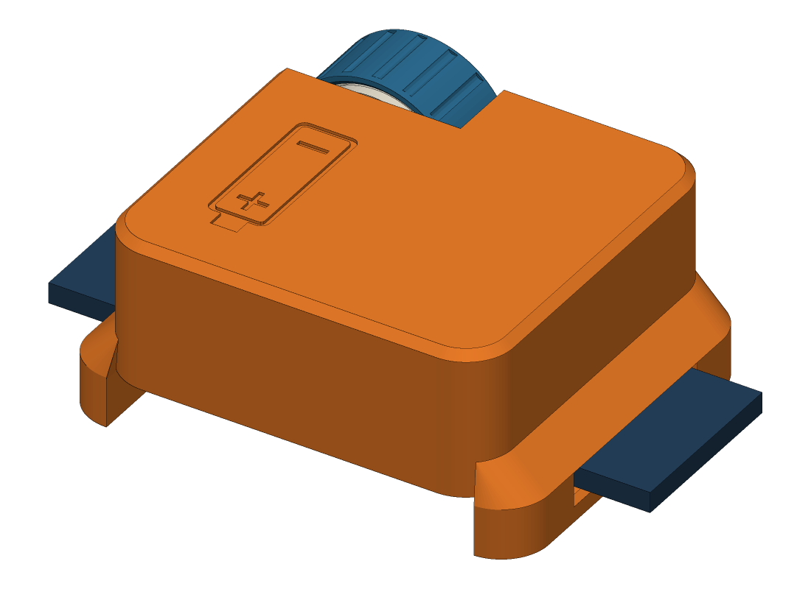
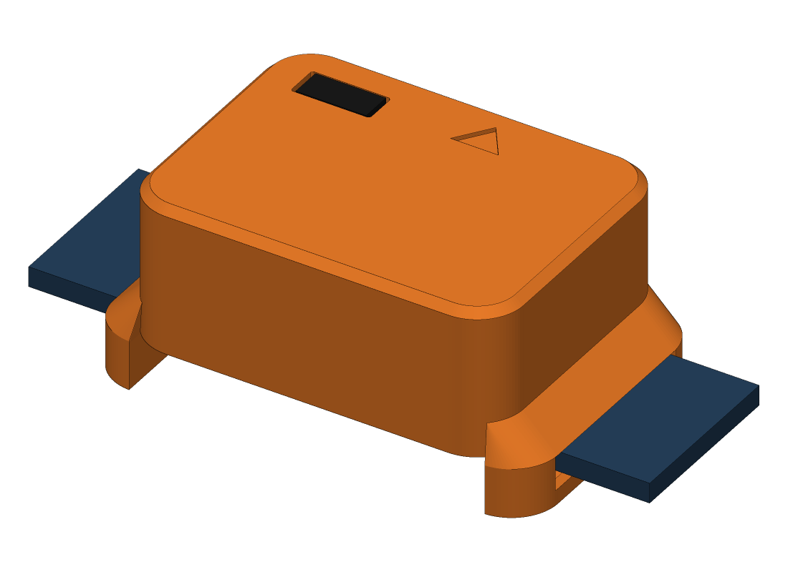
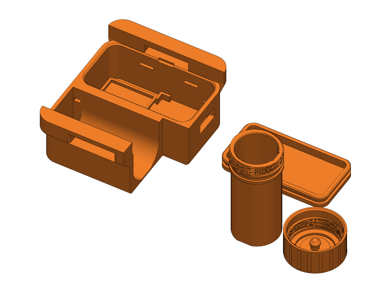
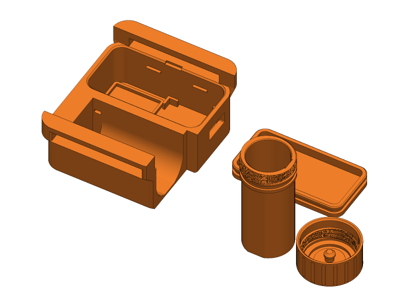
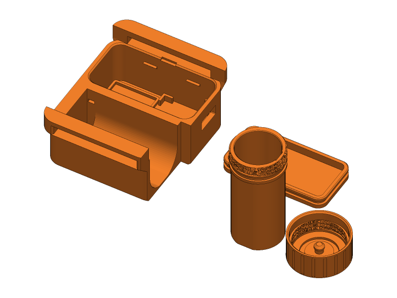
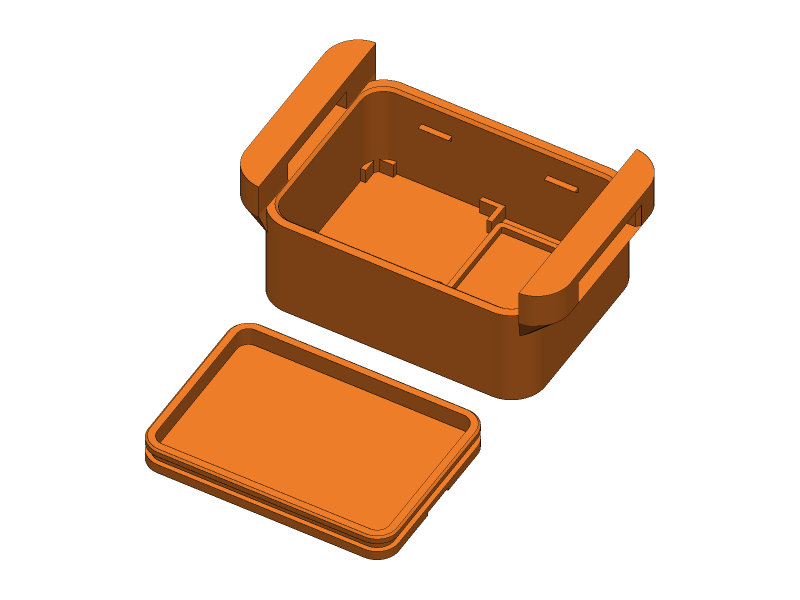
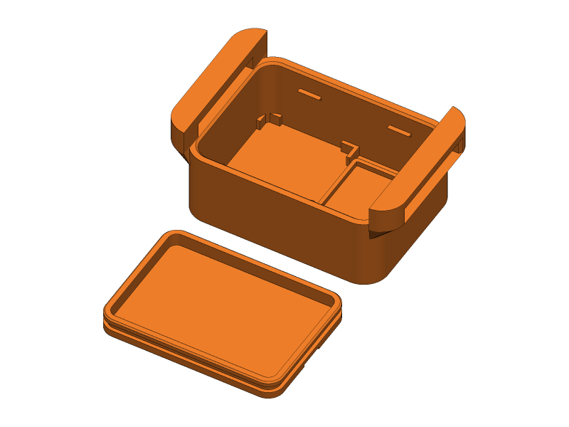
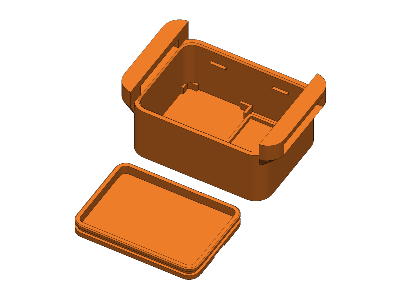

[← All projects](../README.md#projects)

# MeshCore dog tracker

A small sealed pod that rides on a dog's collar and carries a [MeshCore](https://meshcore.co.uk) tracker. Inside are a Seeed XIAO nRF52840 with its Wio-SX1262 LoRa board, a Seeed L76K GNSS module and a lithium battery. You set the pod up as a MeshCore node, let your own node ask it where it is, and find the dog over the mesh.

It comes in two versions, which differ only in the battery.

<table>
<tr>
<td width="50%"></td>
<td width="50%"></td>
</tr>
<tr>
<td valign="top"><b>Swap.</b> A standard 16340 or 18350 lithium-ion cell in a barrel along one side, closed by a screw cap with an O-ring. Unscrew the cap and swap the cell in seconds, without taking the collar off. Charge the spare on its own USB-C port or in a cheap charger, or charge the one inside through the magnetic port.</td>
<td valign="top"><b>Sealed.</b> A LiPo pouch cell sealed inside the pod. It's the smallest and simplest build, with nothing to open in the field. Charge it through the magnetic port.</td>
</tr>
</table>

> [!IMPORTANT]
> **The pod is ready, but the firmware isn't yet.** No MeshCore build for this board reports its location yet, and none sleeps between reports, so today a battery lasts a few days.
>
> The design is aimed at the firmware to come: a tracker that wakes every 15 minutes or so, gets a fix and sends it, which should run for **three and a half to six weeks** on these cells. [Firmware](docs/firmware.md) explains where things stand, what to watch for, and how to test the hardware with Meshtastic in the meantime.
>
> Until then, leave the L76K unconnected at the XIAO end, and the pod works as an ordinary MeshCore node.

This is design revision 2. It hasn't been printed or built yet, so start with the fit test, and please open an issue with anything you find.

## Pick a file

Each file holds every printed part for one build, laid out for the printer. Click a picture to open that file in GitHub's 3D viewer. To print one, load it in Bambu Studio, right-click it and choose **Split > To objects**.

**Swap**

<table>
<tr>
<th></th>
<th>up to ¾ in (19 mm)</th>
<th>up to 1 in (25 mm)</th>
<th>up to 1½ in (38 mm)</th>
</tr>
<tr>
<th>16340</th>
<td align="center"> <a href="stl/dog-tracker-swap-16340-3-4in.stl"><code>dog-tracker-swap-16340-3-4in.stl</code></a></td>
<td align="center"> <a href="stl/dog-tracker-swap-16340-1in.stl"><code>dog-tracker-swap-16340-1in.stl</code></a></td>
<td align="center"> <a href="stl/dog-tracker-swap-16340-1-1-2in.stl"><code>dog-tracker-swap-16340-1-1-2in.stl</code></a></td>
</tr>
<tr>
<th>18350</th>
<td align="center"></td>
<td align="center"> <a href="stl/dog-tracker-swap-18350-1in.stl"><code>dog-tracker-swap-18350-1in.stl</code></a></td>
<td align="center"> <a href="stl/dog-tracker-swap-18350-1-1-2in.stl"><code>dog-tracker-swap-18350-1-1-2in.stl</code></a></td>
</tr>
</table>

**Sealed**

<table>
<tr>
<th></th>
<th>up to ¾ in (19 mm)</th>
<th>up to 1 in (25 mm)</th>
</tr>
<tr>
<th>603040</th>
<td align="center"> <a href="stl/dog-tracker-sealed-603040-3-4in.stl"><code>dog-tracker-sealed-603040-3-4in.stl</code></a></td>
<td align="center"> <a href="stl/dog-tracker-sealed-603040-1in.stl"><code>dog-tracker-sealed-603040-1in.stl</code></a></td>
</tr>
<tr>
<th>803040</th>
<td align="center"></td>
<td align="center"> <a href="stl/dog-tracker-sealed-803040-1in.stl"><code>dog-tracker-sealed-803040-1in.stl</code></a></td>
</tr>
</table>

**Print this first:** [`fit-test-16340.stl`](stl/fit-test-16340.stl) or [`fit-test-18350.stl`](stl/fit-test-18350.stl), about 40 minutes. It has a short piece of barrel with the thread, a cap, a disc that checks your cell's button reaches the + contact, and a piece of wall with the magnetic connector's opening. The [build guide](docs/build-guide.md#2-print-the-fit-test) says what to check.

For any other combination, like a 1¼ in collar, an 18350 on a ¾ in collar, a strap between sizes, a 503040 cell or a cell of your own, export your own file in a couple of minutes: [Changing the design](docs/customizing.md) shows how.

## Which one?

| | Swap, 16340 | Swap, 18350 | Sealed, 603040 |
|---|---|---|---|
| Size on a 1 in collar (along × across × height) | 55 × 55 × 20.8 mm | 57 × 58 × 22.9 mm | 54 × 40 × 21.6 mm |
| Length at the collar bridges | 65 mm | 67 mm | 60 mm |
| Weight, all in (estimate) | about 75 g | about 85 g | about 55 g |
| Battery | 950 mAh cell | 1200 mAh cell | 800 mAh pouch |
| Battery life today (stock MeshCore) | 4 to 5 days | 5 to 6 days | 3 to 4 days |
| Battery life with a sleeping tracker firmware | 4 to 5 weeks | 5 to 6 weeks | 3½ to 4 weeks |
| Flat battery? | Swap the cell in seconds, or charge it | Swap the cell, or charge it | Charge it in the pod, most of a day |
| Parts cost (see the [parts list](docs/parts-list.md)) | about $92 for the first, then about $52 | about $90, then about $49 | about $54, then about $48 |
| Printing | 4 parts, about 2½ hours, 36 g | 4 parts, about 2¾ hours, 40 g | 2 parts, about 1 hour 25 minutes, 22 g |

Across the collar includes the cap, and the height is above the collar: the collar bridges add 7 mm under it. The swap version's size across the collar depends on the collar's width (54 to 61 mm for the 16340), because the cap has to sit beyond the strap's edge.

The sealed version is the one to build if the firmware gets to weeks between charges: charging every few weeks is easy, and it's the smallest and lightest. The swap version is for trips away from power, for charged spares in your pack, and for a battery you can replace in years to come without opening anything. There's also a sealed file for an 803040 cell, about 900 mAh and 2 mm taller, which lasts about as long as the 16340.

All the battery-life figures are estimates from the parts' specs, not measurements. [Firmware](docs/firmware.md#battery-life) has the details.

## Printing

PETG (or ASA), 0.4 mm nozzle, 0.2 mm layers, 4 walls, 30% gyroid infill, 5 top and 5 bottom layers. Nothing needs supports.

| Part | Time | Filament | Notes |
|---|---|---|---|
| Fit test | 37 to 40 m | 7 to 8 g | Print first |
| Swap pod | 1 h 38 m to 1 h 48 m | 24 to 28 g | Outer face down. The wider collars and the 18350 take more. |
| Barrel | 25 to 27 m | 5 to 6 g | Stands on its closed end. A 3 to 5 mm brim helps. |
| Cap | 18 m | 3 g | Stands on its end |
| Swap lid | 11 m | 3 g | |
| Sealed pod | 1 h 9 m to 1 h 12 m | 18 g | Outer face down |
| Sealed lid | 15 m | 4½ g | |

The times are PrusaSlicer estimates. Bambu Studio on a P1S will give you its own, probably shorter.

## How the swap version works

The barrel is a separate part, printed standing up so its thread and O-ring groove come out clean. It's glued into a trough along one side of the pod, next to the sealed compartment that holds the electronics. The cell goes in **+ end first**. The battery sign on the outer face shows which way.

- **The + contact** is a piece of nickel strip on the barrel's floor, sunk 0.4 mm inside a little ring. A cell's button top reaches down to it. A cell put in backwards rests its flat − end on the ring and never touches it, so nothing happens instead of reversed power reaching the XIAO.
- **The − contact** is a conical spring on a washer inside the cap. The washer floats on a small O-ring, and a post through its middle keeps the spring and washer in the cap. When you screw the cap down, the washer lands on a second nickel strip, which folds over the barrel's end and runs back down a groove in the bore, and the small O-ring keeps it pressed there even if the cap backs off a little. The spring holds the cell against the + contact, and a capacitor by the XIAO carries it through any bounce when the dog jumps.
- **The strips' tails** come out through the barrel's floor into a pocket, where they're soldered to two wires. The pocket is filled with epoxy, which seals it and holds the barrel in. The wires run on into the compartment to the XIAO's battery pads.
- **The seal.** An O-ring on the barrel presses sideways against a smooth bore in the cap, so the cap only has to hold it on. The thread has two starts, closes in about 1¼ turns, and stops when the washer, on the strip, reaches its seat in the cap.
- **The compartment** is closed from the back by a push-in lid with its own O-ring. The collar lies across the lid, so it can't come out while the pod is on the dog.
- **Charging.** The magnetic port in the end wall, next to the cap, feeds the XIAO's charger. It charges the cell in the barrel, slowly. A spare charges faster outside the pod.

## Docs

- **[Parts list](docs/parts-list.md)**: everything to buy, with prices and links, as a checklist by what it's for and again by store, plus [`parts.csv`](docs/parts.csv) to sort and filter in a spreadsheet.
- **[Build guide](docs/build-guide.md)**: printing, the fit test, the barrel's contacts, wiring, sealing, fitting it to the collar, swapping and charging, and troubleshooting.
- **[Firmware](docs/firmware.md)**: where MeshCore stands on this board, what a tracker that lasts weeks needs, battery life, and how to flash and set it up.
- **[Changing the design](docs/customizing.md)**: the settings in the OpenSCAD source (cell, pouch, collar, fits) and how to export and check your own files.

The source is [`cad/dog-tracker.scad`](cad/dog-tracker.scad) (OpenSCAD 2021.01 or newer). The scripts in [`cad/tools/`](cad/tools) rebuild the STLs, check the parts against each other and draw the pictures.

## Safety

- **It's a lithium battery on a dog.**
  - Use protected cells only: the XIAO doesn't cut off a flat battery. The swap version needs **protected, button-top, rechargeable 3.6 or 3.7 V** lithium-ion cells.
  - **Never put a CR123A, or any other non-rechargeable cell, in the barrel,** and never a LiFePO4 ("3.2 V") cell. They're the same size as a 16340, and the pod charges to 4.2 V.
  - Charge with the pod off the dog, on something that won't burn, and only between about 0 and 45 °C. The charger doesn't check the cell's temperature, so let a cold pod warm up first.
  - Check the cell's wrap at every swap. Retire a cell that's dented or has a nick or tear in its wrap, and a pouch cell that's puffy. On many protected cells the can under the wrap is the raw negative, so a torn wrap can bypass the protection.
  - Keep spare cells in a case, away from keys and coins, where the dog can't chew them. Don't leave the pod or spares in a hot car.
  - Retire a pod that's been chewed or cracked. If a pod ever gets hot, smells, or its cap or lid is being pushed out from inside, take it off the dog and put it outside, away from anything that burns, until it's cool. Never glue or tape the cap on.
- **The collar can catch.** Use a breakaway collar if your dog is ever left unattended in it. If your dog pulls hard, clip the lead to a harness: a hard pull on the collar goes through the pod's collar bridges.
- **It's a hobby build**, not a certified pet tracker. Don't rely on it as the only way to find your dog.

## License

[CC BY-NC-SA 4.0](https://creativecommons.org/licenses/by-nc-sa/4.0/). You're welcome to build it, change it and share it for non-commercial use, as long as you give credit and share your changes under the same license. Selling prints, kits or finished units, or using the design in a paid product or service, needs my written permission first. Open an issue to ask. The full terms are in [LICENSE](../LICENSE).
