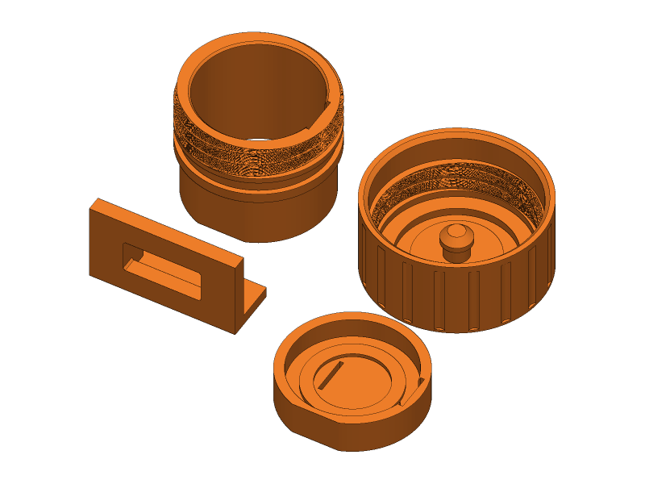
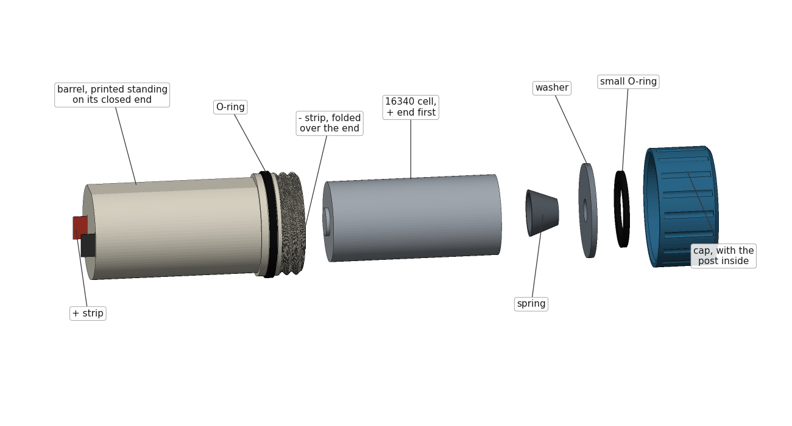
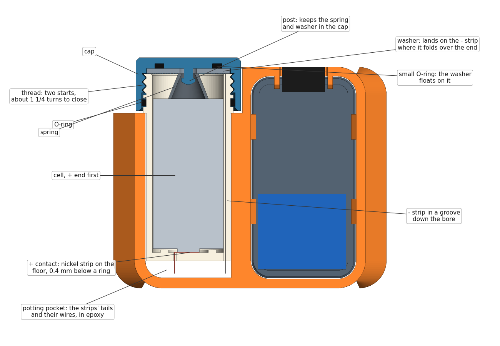
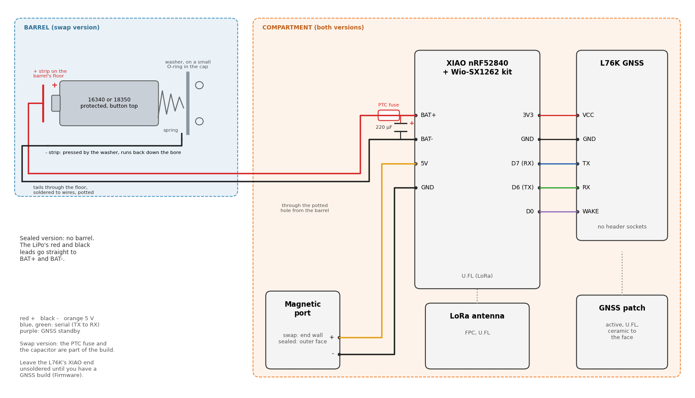
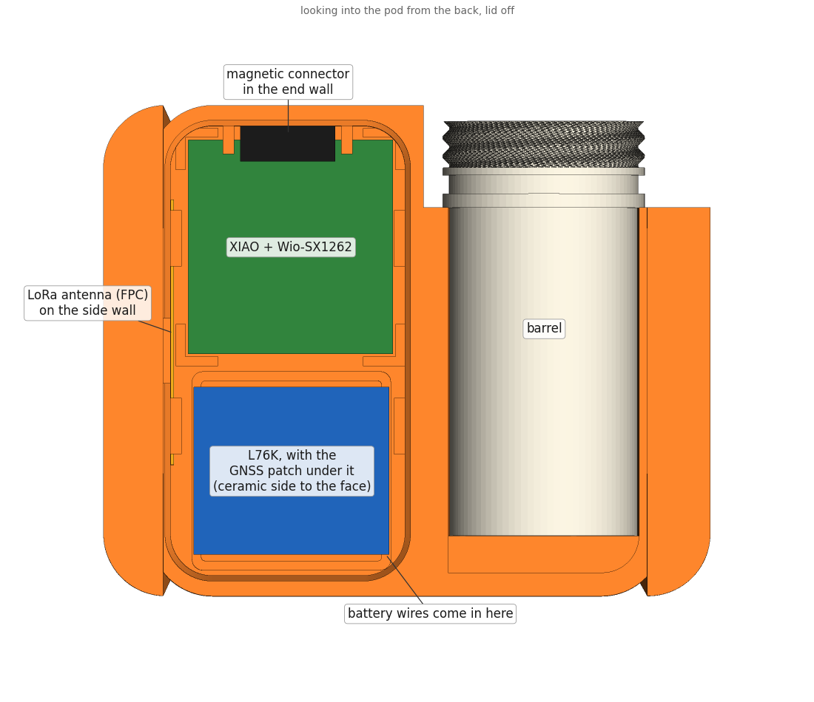
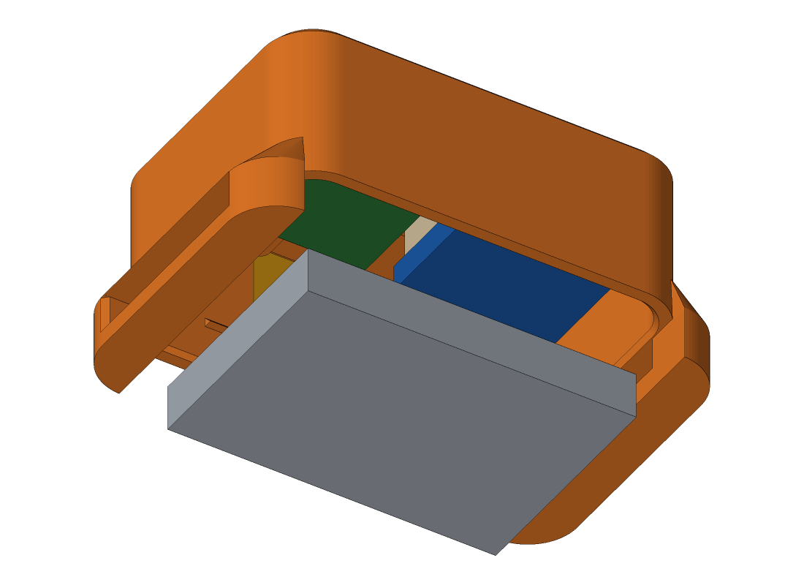
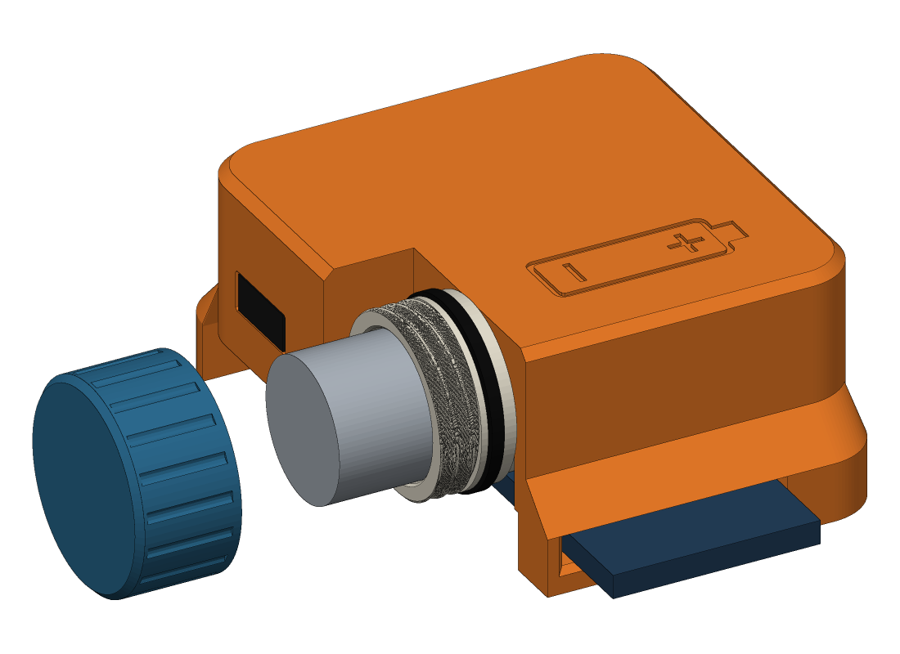

# Build guide

This is the whole build, start to finish, in the order I'd do it. Read it through once before you start. Some steps need an earlier one done first, and the battery steps need care.

Most of it applies to both versions. Steps that are only for the **swap** version (cell in a screw-cap barrel) or the **sealed** version (pouch cell inside) say so. A few words that may be new are explained in the [glossary](#glossary) at the end.

- [1. Before you start](#1-before-you-start)
- [2. Print the fit test](#2-print-the-fit-test)
- [3. Print the parts](#3-print-the-parts)
- [4. Dry-fit everything](#4-dry-fit-everything)
- [5. Flash the firmware](#5-flash-the-firmware)
- [6. Set the magnetic connector](#6-set-the-magnetic-connector)
- [7. Fit the contacts in the barrel (swap)](#7-fit-the-contacts-in-the-barrel-swap)
- [8. Fit the cap's washer and spring (swap)](#8-fit-the-caps-washer-and-spring-swap)
- [9. Wire the electronics](#9-wire-the-electronics)
- [10. Glue the barrel in (swap)](#10-glue-the-barrel-in-swap)
- [11. Test it on the bench](#11-test-it-on-the-bench)
- [12. Put the electronics in](#12-put-the-electronics-in)
- [13. Close the pod](#13-close-the-pod)
- [14. Test it, soak it, shake it](#14-test-it-soak-it-shake-it)
- [15. Put it on the collar](#15-put-it-on-the-collar)
- [16. Swapping and charging](#16-swapping-and-charging)
- [17. Opening it later](#17-opening-it-later)
- [18. Troubleshooting](#18-troubleshooting)
- [Glossary](#glossary)

## 1. Before you start

1. **Pick your file.** The [README](../README.md#pick-a-file) lists them. Pick the version and cell, then the file for your collar's width. If your collar is between two sizes, export a file for its exact width ([Changing the design](customizing.md#your-collar)) rather than using the next size up, which would let the pod slide about.
2. **Get the parts together.** The [parts list](parts-list.md) is a checklist.
3. **Read [Firmware](firmware.md).** No build reports this pod's location yet, or sleeps long enough to last weeks. Until one does, you'll fit the L76K but leave it unconnected at the XIAO end.
4. **Respect the cell.** A lithium cell shorted through a pair of pliers gets hot fast.
   - Solder the cell's leads (sealed) one at a time, so the bare ends never touch, and cover each joint before you start the next.
   - Swap version: keep the cell out of the barrel until the final test in step 14. The only exceptions are the quick checks in steps 2, 8 and 10 and the bench test in step 11. Whenever a cell is in and the battery wires aren't soldered to the XIAO yet, tape their bare ends apart.
   - Never put a CR123A or any other cell that isn't rechargeable in the barrel, and never a LiFePO4 ("3.2 V") cell. They're the same size as a 16340, and the pod charges to 4.2 V.

## 2. Print the fit test

Print `fit-test-16340.stl` or `fit-test-18350.stl`, whichever matches your cell. It takes about 40 minutes, and saves you from finding a problem after a two-and-a-half-hour print. It has four pieces, printed the same way up as the real parts:

- **Thread piece.** A short piece of barrel: 8 mm of the bore the cell slides in, the O-ring groove and the thread.
  - Slide a cell through the bore. It should go freely.
  - Roll the cap's O-ring (20 × 1.5 mm for a 16340, 22 × 1.5 for an 18350) over the thread into the groove, and give it a thin film of silicone grease.
  - Screw the cap on. It should turn by hand, with a little drag from the O-ring, and close in about 1¼ turns. It's a right-hand thread: clockwise to close, seen from the cap's end.
- **Cap.** The real cap. Do [step 8](#8-fit-the-caps-washer-and-spring-swap), items 1 to 4, to fit its small O-ring, washer and spring, and keep it: it's the cap you'll use. The full print has another cap, so you'll have a spare. Then turn the cap over, shake it and push the spring sideways: the spring and washer must stay in.
- **Contact disc.** The barrel's floor with the ring round the + contact. It checks that your cell's button top reaches the contact and a reversed cell doesn't.
  1. Fit a + strip as in [step 7](#7-fit-the-contacts-in-the-barrel-swap).
  2. Stand the cell on the disc, + end down.
  3. Measure between the strip's tail and the cell's − end. You should read the cell's voltage.
  4. Turn the cell over, − end down, and you should read nothing.

  If a cell doesn't read when it's the right way round, its button is too flat for the ring. Use a different cell, or export a barrel with `KEEPER` set lower ([Changing the design](customizing.md)).
- **Wall piece.** The magnetic connector's opening, in a piece of wall the same thickness as the pod's. The half of the connector with the flat contacts should push in from behind, with its face level with the front. The opening is 11.5 × 5 mm, and the two rails behind it keep the connector square.

Also look at your cell's − end. The spring touches it in a ring about 9 mm across, so the metal contact there needs to be at least 10 mm across. On a few protected cells it's a small disc in the middle of an insulating ring, and those won't connect.

If anything doesn't fit, [Changing the design](customizing.md#fits-for-your-hardware) says which setting to change.

## 3. Print the parts

**Settings:** PETG (or ASA), 0.4 mm nozzle, 0.2 mm layers, 4 walls, 30% gyroid infill, 5 top and 5 bottom layers. Most walls are 0.8 to 2.2 mm thick, so with 4 walls they print as solid plastic with no infill inside, and that's what keeps water out. The layer height matters for one thing: the groove for the small O-ring in the cap is drawn a whole number of 0.2 mm layers deep.

**Split the file.** Load your file in Bambu Studio, right-click it and choose **Split > To objects**. The swap version gives you four parts: pod, lid, barrel and cap. The sealed version gives you two: pod and lid. They're already laid out the way they print, so if you use Arrange, don't let it rotate them.

- The **pod** prints outer face down, with the collar bridges on top. The bridges span the strap tunnels, 20 to 39 mm depending on the collar width. A printer that bridges cleanly does them without supports.
- The **barrel** stands on its closed end, so its thread and the O-ring groove come out clean. It's tall and thin, so a 3 to 5 mm brim helps. The underside of the step where it gets wider, and the top edge of its O-ring groove, overhang a little and may droop. Trim any droop with a craft knife.
- The **cap** stands on its end, thread up.
- The **lid** prints plate down.

Nothing needs supports. When the parts are off the plate:

- Clean any strings out of the barrel's bore, the groove down one side of it, and the two slots in its floor.
- Run a fingertip round the inside of the pod's lid opening and the cap's bore, and take off any blob with a craft knife. They're sealing surfaces.

## 4. Dry-fit everything

Do this before any glue goes near it.

1. **Lid.** Without its O-ring, the lid should push into the pod's back with light pressure and stop flush with the rim on four little tabs inside. Line up the notch in the lid's edge with the notch in the pod's rim: that's where you lever it out later. If it's tight, sand the lid's skirt, not the pod.
2. **Swap only: the barrel.** Turn the pod over, outer face down.
   - The barrel drops into the open trough along one side, from the back. Its flat goes against the trough's flat side, toward the outer face, and its threaded end sticks out into the notch at the corner.
   - The step where the barrel gets wider sits against the pod's face at the notch.
   - It only fits one way. The groove down the inside of the barrel ends up on the side toward the compartment, and the floor's "+" and "−" marks face into the pocket at the end of the trough.
   - Screw the cap on and off once, then take the barrel out again.
3. **The boards.** Sit each one in its place, as in [step 12](#12-put-the-electronics-in), without tape: the XIAO kit in its corner posts, the GNSS patch in its square well with the L76K behind it, and the antenna along the wall. The well takes a patch up to 19 mm square. If something doesn't sit flat, or stands past the rim where the lid goes, find out why now.

## 5. Flash the firmware

Flash the XIAO now, while you can still get at its USB-C port. [Firmware](firmware.md) covers which build and how. Plug the LoRa antenna into the Wio-SX1262 board before you power it up for the first time.

## 6. Set the magnetic connector

Do this before the rest of the wiring, so nothing is hanging off the pod while the epoxy sets.

1. Snap the two halves together. With the cable plugged into a USB charger, find which contact on the flat half is + (5 V), and mark it on the half's back.
2. Check it only snaps on one way round: turned over, the magnets should push apart. If it connects either way, wire a small Schottky diode (a 1N5817, say) in series with its + lead, or the XIAO can get reversed power.
3. Solder an 8 cm red wire to its + pin and a black one to the other, and cover each joint with heat shrink. It's easier now than once it's potted.
4. Put a strip of tape over the opening, sticky side in.
   - **Swap:** the opening is in the end wall of the compartment, next to the cap.
   - **Sealed:** it's in the outer face.
5. From inside, push the flat half through its opening until its face sits on the tape, level with the outside. On the swap version, the two rails hold it square. Put a dot of paint or a scratch on the outside next to the + contact, so you know which way round the cable goes.
6. **Swap:** put a strip of tape along the inside of the lid opening below the connector first. The lid's skirt slides there, and its O-ring seals there, so no epoxy may land on it.
7. Fill round the connector from inside with a thick epoxy, so no gap is left. On the swap version, keep it to the connector's sides and the side toward the outer face; the lid's skirt passes 0.3 mm below it.
8. Stand the pod so the connector's face is down on the tape while the epoxy sets: on its end wall (swap) or on its outer face (sealed).
9. **Swap:** once the epoxy has gone stiff but before it's hard, wrap the lid's skirt in cling film and push the lid in, without its O-ring, to check it goes all the way home without touching the epoxy. Then take it out again.
10. When the epoxy is hard, peel off the tapes and clean any epoxy off the contacts.

## 7. Fit the contacts in the barrel (swap)

Both contacts are pure nickel strip, 5 mm wide.

1. **Tin the ends first.** Nickel takes solder slowly, and heating it once it's in the barrel would soften the plastic. For each strip below, tin the last 3 mm of the end that will stick out of the floor, with flux, before you fit it.
2. **The + strip.** Cut 12 mm of strip and bend the last 6 mm down at a right angle.
   - From inside the barrel, push the bent leg down through the slot inside the little ring on the floor. On the outside of the floor, that slot is marked "+".
   - The flat leg lies on the floor across the middle, inside the ring, and stops about 2 mm short of the ring on the far side. It mustn't climb onto the ring.
   - Put a small drop of gel superglue under the flat leg with a toothpick, not on top where the cell touches it.
3. **The − strip.** Cut 51 mm of strip for a 16340 barrel, or 54 mm for an 18350.
   - Smooth both cut edges with fine sandpaper or a file, so there's no burr. The strip runs the whole length of the bore, next to the cell's wrap. On many protected cells the can under the wrap is the raw negative, so a sharp edge that cut through the wrap would bypass the cell's protection.
   - Push one end down the groove on the inside of the barrel from the open end, and on through the slot in the floor marked "−". Stop when about 1.5 mm stands up above the barrel's end.
   - Fold that end outward over the barrel's end face and press it flat.
   - Trim it level with the outer edge of the end face. It must not hang down over the thread, or reach the O-ring groove.
   - Put a small drop of superglue under the folded tab, and run a few drops down the groove to hold the strip in it. Keep glue off the top of the tab: that's where the washer touches it. The strip must lie flat in the groove, below the surface of the bore.
4. **Seal the slots.** From inside the barrel, put a small drop of gel superglue where each strip goes through the floor, so the slot is closed round it. Otherwise epoxy from the pocket behind the floor can seep through onto the + contact in step 10.
5. **Wires.** Outside the floor, about 4 mm of each strip sticks out.
   - Solder an 8 cm red wire to the + tail, and a black one to the − tail. Hold the tail with tweezers while you do it, so they take the heat instead of the floor, and be quick.
   - Put heat shrink over each joint, and keep the two apart.
   - Bend both tails flat against the floor so they sit in the pocket later.

## 8. Fit the cap's washer and spring (swap)

The washer is the cap's half of the − contact. It floats on a small O-ring in the bottom of the cap, and a post through its middle keeps the spring, and so the washer, in the cap.

1. **Small O-ring.** Press the 12 × 1.5 mm O-ring into the round groove in the bottom of the cap, round the post.
2. **Washer.** Drop it over the post, onto the O-ring, with its smoother side toward you (a stamped washer has a burr on one side; that goes down). It must sit loosely, and rock when you tip the cap. If it binds on the pocket's wall, scrape the wall with a craft knife until it doesn't, because the O-ring has to be able to push it.
3. **Spring.** Put the spring's narrow end over the post's head and screw it on, whichever way it threads, until its end turn has passed the head and sits on the washer.
4. **Lock it on.** Touch a hot soldering iron (an old tip, about 250 °C) to the very top of the post for a second or two, so the tip of the post melts and spreads over the head. Don't push down past the head, and keep the iron off the spring. If you'd rather not, a small dab of thick epoxy on the top of the post does the same job, as long as none of it touches the spring. Now turn the cap over and shake it: the spring and washer stay in, and when you press the washer it moves in a little on the O-ring and springs back.
5. **Seal O-ring.** Roll the cap's big O-ring (20 × 1.5 for a 16340, 22 × 1.5 for an 18350) over the barrel's thread into its groove, the one next to the step where the barrel gets wider. Give it a thin film of silicone grease.
6. **Check the barrel.** Tape the bare ends of the red and black wires apart. Drop a cell in, + end first, and screw the cap on. You'll feel the spring, then the washer land on the strip and squeeze the small O-ring, which makes the last part of the turn firmer, then a firm stop. Keep turning until it stops. Measure between the red and black wires: you should read the cell's voltage, with + on red.
   - Back the cap off a little, about 1.5 mm measured round its edge: it should still read. That's the small O-ring keeping the washer on the strip.
   - Take the cell out and put it in backwards: you should read nothing. The ring keeps the cell's − end off the + strip.
   - Take the cell out again.

## 9. Wire the electronics

Use 30 AWG silicone wire. Leave the wires 6 to 8 cm long. Later, when you want the XIAO's USB-C port, you'll lift the XIAO out of the pod, and the wires need to let it come out without unsoldering anything. Much longer than that and they crowd the patch antenna. The Wio-SX1262 board already uses the XIAO's D1 to D5 and D8 to D10, so don't use those.

1. **L76K.** Don't fit the header sockets that come with it. Solder five wires to its pads:
   - 3V3, to the XIAO's 3V3
   - GND, to GND
   - its TX, to the XIAO's **D7** (RX)
   - its RX, to the XIAO's **D6** (TX)
   - its wake-up (standby) line, to the XIAO's **D0**

   Leave the L76K's reset unconnected. Seeed's [L76K page](https://wiki.seeedstudio.com/get_start_l76k_gnss/) and its schematic show which pad is which. Plug the patch antenna's lead into the L76K's U.FL connector.

   **Until you have a GNSS build, solder the L76K's end only, and leave the XIAO end of its five wires unsoldered, taped over.** Stock builds use D6 and D7 for something else, and nothing would tell the L76K to go on standby. It would run flat out, at about 41 mA.
2. **Magnetic connector.** Its red wire goes to the XIAO's **5V** and its black one to **GND**.
3. **Battery.** Solder an 8 cm red wire to the XIAO's **BAT+** pad and a black one to **BAT−**. The pads are on the XIAO's underside, the side that faces the Wio-SX1262 board, and Seeed's [XIAO nRF52840 wiki](https://wiki.seeedstudio.com/XIAO_BLE/) shows where they are. If your kit came in two pieces, solder these wires before you join the boards, and lead them out sideways. If it came joined, you'll need a fine tip and thin wire, so look before you start.
   - **Swap:** in step 10 you'll join these to the barrel's wires, with two small parts that are both in the wiring diagram:
     - a **PTC fuse** in the red wire, between the barrel and BAT+. It trips if something shorts, even if the cell's own protection has been bypassed.
     - a **220 µF capacitor** across the red and black wires, close to the XIAO, with its − side (the striped side, the shorter lead) to the black wire. It carries the XIAO through the moment a contact bounces when the dog jumps.

     There's room for both under the XIAO.
   - **Sealed:** cut the connector off the LiPo, one lead at a time. Join its red lead to the red wire and its black lead to the black one, one at a time, and cover each joint in heat shrink before you start the next.

## 10. Glue the barrel in (swap)

1. Lay the pod outer face down. Thread the barrel's red and black wires through the small slot in the side of the pocket, at the end of the trough, into the compartment.
2. Put a thin line of epoxy along the trough's flat side. Press the barrel in as you did in step 4, pulling the wires through as it goes, so its floor and the strip tails sit in the pocket.
3. **Plug the slot from inside first.** From the compartment side, press a small blob of thick epoxy round the wires where they come through the slot, no more than 1 mm proud, and let it set. Otherwise the potting epoxy runs through into the compartment. The L76K will sit just above the slot, so lead the wires down and along the end wall, not up.
4. **Pot the pocket.** Fill it with epoxy, level with the back of the pod. It covers the barrel's floor, the tails and their joints, and the slot.
5. Before it sets, with the wire ends taped apart, put a cell in the barrel and the cap on, check between the red and black wires that you still read the cell's voltage, then take the cell out again.
6. Let it cure fully before you go on. Then join the barrel's wires to the XIAO's: red to red through the PTC fuse, and black to black. Solder the capacitor's leads across the two joined wires close to the XIAO, − side to black. Cover every joint in heat shrink.

## 11. Test it on the bench

Do this before anything goes in the pod, on both versions.

- **Swap:** put a cell in the barrel and screw the cap on. **Sealed:** the LiPo is already soldered to the XIAO, so it powers up as soon as it's connected.
- Check that it boots and the MeshCore app finds it.
- Clip the magnetic cable on and check that the XIAO's charge LED lights. You won't be able to see it once the pod is closed.
- Unclip it and measure between the magnetic connector's two contacts: they should read 0 V. They're bare on the outside of the pod, and must never carry the battery's voltage.
- If you have a multimeter with a mA range, put it in series with a battery lead and check the draw. A few mA is right. About 45 mA means the L76K is running, so check its wiring and your firmware.
- If you flashed a GNSS build, take it outside and wait for a fix.
- **Swap:** take the cell out again when you're done.

## 12. Put the electronics in

Everything sits against the inside of the outer face, located by little L-shaped corner posts. The picture above shows the swap pod from the back, with the lid off. [This one](../images/layout-sealed.png) shows the sealed pod.

- **GNSS patch:** in the square well, ceramic side against the outer face, lead out the back.
- **L76K:** stacked behind the patch.
- **XIAO kit:** in its four corner posts, flat against the face. Either way round fits; pick the one where the LoRa antenna's lead reaches the Wio-SX1262 board's U.FL connector without crossing the patch.
- **LoRa antenna:** flat against the inside of the long side wall.
  - Swap: the wall away from the barrel.
  - Sealed: the long wall that the arrow on the outer face points to.
  - Keep it off the XIAO and the L76K.

Hold each board to the face with a small piece of thin double-sided tape, about 0.2 mm, between the board and the face. Tuck the wires into the gaps round the edges. Nothing may cross the front of the patch, and nothing may stick out past the rim where the lid's skirt goes.

## 13. Close the pod

1. **Sealed only:** cover the backs of the boards with a layer of Kapton tape or a piece of thin insulating sheet (fish paper or PET), so no solder joint or connector can rub through the pouch. Then lay the LiPo in the back of the pod, over it, with a strip of thin double-sided tape on the side facing the lid. There's less than 1 mm to spare.
2. Stretch the lid's O-ring (41 × 1.5 for swap, 48 × 1.5 for sealed) into the groove round the lid's skirt. Check it isn't twisted, then wipe on a thin film of silicone grease.
3. **Let the air out as it goes in.** Lay a 15 cm piece of thin nylon fishing line diagonally across one corner of the opening, away from the four little stop tabs, with both ends hanging outside. It gets trapped between the lid's skirt and the pod at that corner.
4. Push the lid in until it sits flush with the rim on its stops, notch to notch. Push it straight, not one corner first, and don't let it pinch a wire.
5. Pull the fishing line out. The air the lid squeezed in escapes along it, so the lid doesn't creep back out, and the O-ring closes up behind it.

## 14. Test it, soak it, shake it

1. **Soak the pod.** On the swap version, do this with the cell out and the cap screwed on. Hold it under a running tap for a minute, turning it over. Then leave it in a bowl of water for 10 minutes.
2. Dry it and open it up:
   - Open the lid and look for water.
   - Swap: unscrew the cap and look for water in the barrel.

   If water got in, it's nearly always an O-ring: twisted, missing its grease, or not all the way home. The next most likely places are the epoxy round the magnetic connector and the pocket behind the barrel. Fix it, and test again before it goes on a dog.
3. **Swap:** dry the barrel, drop a charged cell in, + end first, and screw the cap on until it stops. The node should show up in the MeshCore app.
4. Clip on the magnetic cable, and check in the app that the battery voltage starts to rise.
5. **Shake it.** Hold the pod in your fist and shake it hard, like a dog shaking off water, for half a minute. Tap it hard on a table a few times, on each face and on the cap. Then check in the app that the node is still up and hasn't restarted.

## 15. Put it on the collar

1. Take the collar off the dog. Thread it through the bridge at one end of the pod, under the pod, and out through the bridge at the other end. The outer face, the one with the battery sign (swap) or the arrow (sealed), faces away from the dog.
2. **Swap:** turn the pod so the cap points toward the dog's shoulders. A scratching paw is less likely to reach it there.
3. Put the collar back on with two fingers' room, as usual. The GNSS works best with the pod on top of the neck, and worst under the chin.

The swap version weighs about 75 to 85 g with its cell, and the sealed one about 55 g. That's fine on a medium or large dog. On a small dog, try the weight on its collar first; the sealed version is the lighter choice.

## 16. Swapping and charging

**Swapping a cell (swap version).**

1. Unscrew the cap, anticlockwise, about 1¼ turns. The spring and washer come away with it.
2. Take the collar off, or hold the dog's head up, and tip the pod so the cap points down. The cell slides out.
3. Look at the cell's wrap. Retire a cell with a nick or tear in it.
4. Drop a charged cell in, **+ end first**. The battery sign on the outer face shows which way.
5. Screw the cap on, clockwise, until it stops firmly. You'll feel the spring, then the washer squeezing its O-ring, then the stop. Hand-tight is enough.

Now and then, wipe the O-ring and give it a fresh film of grease, and check the − strip is still flat on the barrel's end.

**Charging in the pod.** Take the collar off the dog, and put the pod on something that won't burn. Clip the magnetic cable on: the end wall next to the cap on the swap version, the outer face on the sealed version. The XIAO charges at 50 mA, or 100 mA if the firmware turns on its fast mode, and the node's own few mA come out of that. A flat cell takes a long time: about 11 to 22 hours for a 950 mAh 16340, and 13 to 30 hours for a 1200 mAh 18350, depending on whether the firmware turns the fast mode on.

**Charging a spare (swap version).** A cell with its own USB-C port, like the NL169R, charges from any USB-C cable in a couple of hours. Other cells go in a USB charger like the XTAR MC1.

**Every time you charge:**

- Only charge between about 0 and 45 °C. The XIAO's charger doesn't check the cell's temperature, so let a cold pod warm up indoors first.
- Keep spare cells where the dog can't chew them, in a case, away from keys and coins.
- Don't leave the pod or spare cells in a hot car.

## 17. Opening it later

The lid pulls straight out: lever it gently at the notch in the rim, reached through the strap tunnel when the pod is off the collar. To get at the XIAO's USB-C port, peel it off the face and lift it out on its wires. When you close the pod again, check the O-ring, give it fresh grease, and let the air out with the fishing line as in [step 13](#13-close-the-pod).

The lid is held in by its O-ring, and by the collar when it's on. If a pod has been somewhere hot, like a car in the sun, the air inside can push the lid out a little. On the swap version, push it back until it's flush. On the sealed version, open it and look at the pouch cell first: a pouch that's swelling pushes the lid out too. Retire a puffy cell straight away, outdoors, away from anything that burns.

The swap version's barrel is glued in for good. If it breaks, print a new pod and barrel. Retire any pod that's been chewed or cracked.

If a pod ever gets hot, smells, or its cap is hard to undo as if something is pushing on it from inside, take it off the dog, put it outside away from anything that burns, and leave it to cool before you open it. Never glue or tape the cap on.

## 18. Troubleshooting

**The node doesn't start with a cell in (swap).**

- Check the cell is in + end first. Put in backwards, it simply doesn't connect.
- Check the cap is screwed all the way down.
- Look at the barrel's end face: the − strip must lie flat on it. If it's bent up, cut off, or covered in glue, the washer can't reach it.
- Check the spring is still on the post, and the washer and small O-ring are in the cap. The washer must move in and out a little when you press it.
- Try another cell. A flat-top cell can't reach the + contact, and a cell whose protection has tripped reads close to 0 V until it's had a little charge.
- With a cell in and the cap on, measure at BAT+ and BAT−. If the PTC fuse is warm, something is drawing too much: find it before you try again.

**It restarts when the dog runs or shakes (swap).**

- Check the cap is tight, and the small O-ring is under the washer.
- Check the spring is the 0.7 mm wire one ([parts list](parts-list.md#barrel-and-cap)). The thinner springs don't push the cell hard enough.
- If you left the capacitor out, fit it.

**The cap is hard to turn.**

- Check the O-ring isn't twisted, and has grease on it.
- Look for a string or blob on the thread, and trim it with a craft knife.
- The last part of the turn is meant to be firmer, as the washer squeezes its O-ring.

**The lid is hard to get in, or creeps out.**
Check the O-ring isn't twisted and has grease on it. If it's still tight, sand the lid's skirt lightly all round. Don't sand the pod's opening, because the O-ring seals against it. If it creeps out after a while, you've trapped air: let it out with the fishing line ([step 13](#13-close-the-pod)).

**No GNSS fix.**

- Check you're on a GNSS build ([Firmware](firmware.md)), and that the L76K's wires are connected at the XIAO end.
- Check the patch antenna's lead is fully clicked onto the L76K.
- The patch has to face the sky through the outer face, and wires or tape in front of it cut the signal.
- The first fix after a long time off can take a few minutes outside.

**The battery doesn't last.**
With a stock MeshCore build, a battery lasts a few days, and with GNSS on all the time, less than a day. That's the firmware, not the pod. [Firmware](firmware.md#battery-life) explains what to expect now and what to wait for.

## Glossary

- **Button top.** A cell whose + end has a raised button, like an AA battery. The swap version needs one.
- **Protected cell.** A lithium-ion cell with a small circuit under its wrap that cuts it off if it's shorted or run too flat.
- **16340, 18350.** Cell sizes: 16 or 18 mm across, 34 or 35 mm long (a little more with protection and a button).
- **LiPo pouch cell.** A flat lithium cell in a foil pouch, like a phone battery. Its size code, like 603040, is thickness (6.0 mm), width (30 mm) and length (40 mm).
- **O-ring.** A rubber ring that seals by being squeezed. They're sold by inside diameter and cross-section (the thickness of the ring), like 20 × 1.5 mm.
- **Radial seal.** An O-ring squeezed sideways between a groove and a bore, like the cap's and the lid's. It seals without being clamped.
- **Two-start thread.** A thread with two ridges wound side by side, so the cap closes in fewer turns.
- **Potting.** Filling a space with epoxy to seal and hold what's in it.
- **PTC fuse.** A resettable fuse: it goes high-resistance when too much current flows, and recovers when it cools.
- **U.FL.** The tiny snap-on antenna connector on the Wio-SX1262 board and the L76K.
- **UF2.** The firmware file format the XIAO takes by drag and drop when it shows up as a USB drive.
