[← All projects](../README.md)

# Tahoe MeshCore solar repeater

A [MeshCore](https://meshcore.co.uk) repeater that lives on a tree. A RAK4631 radio, a 15 Ah LiFePO4 cell and a small 5 V solar panel go in a 3D-printed enclosure that closes with a quarter turn and locks without tools.

I designed it for Lake Tahoe: 6,200 ft, snow on the roof for months at a time, and a long fire season. That drove most of the choices. The cell is LiFePO4 rather than lithium-ion. One charger is set up properly for it, with a temperature sensor and a fuse at the cell. Every opening is on the underside, and the roof sheds snow away from the tree.

<table>
<tr>
<td width="33%">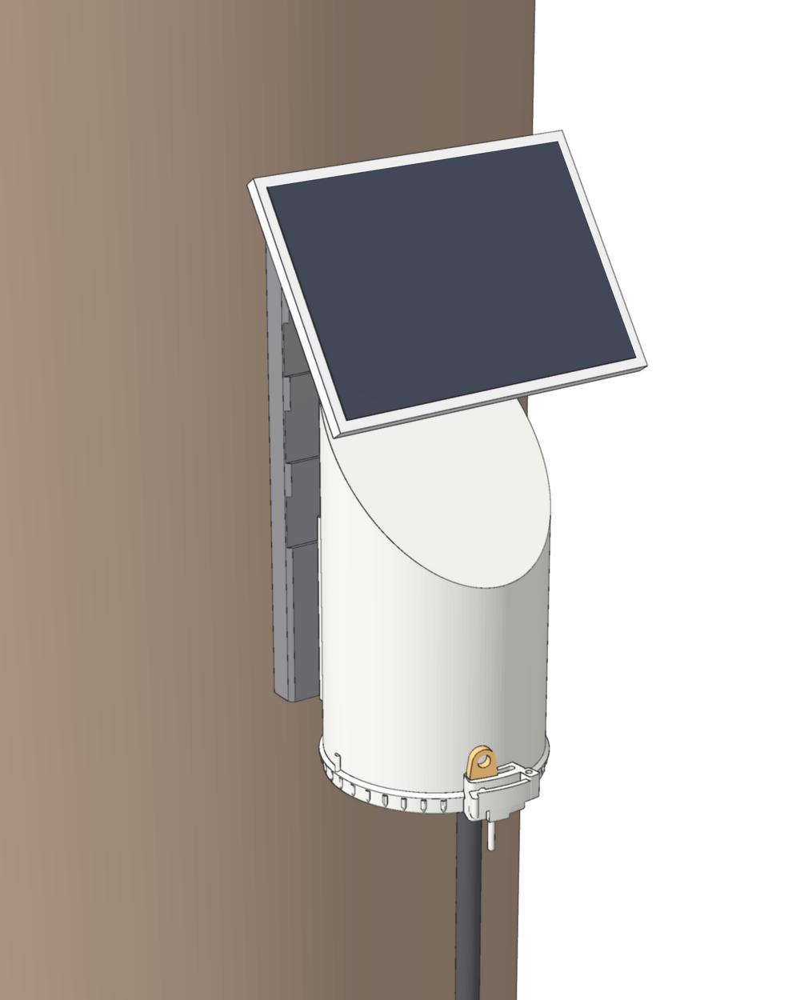</td>
<td width="33%">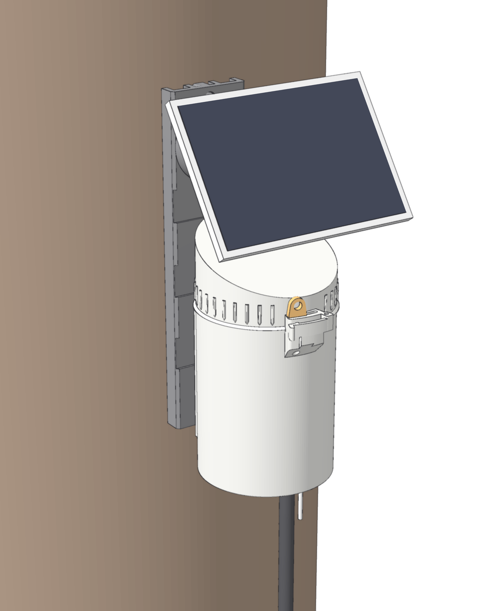</td>
<td width="33%">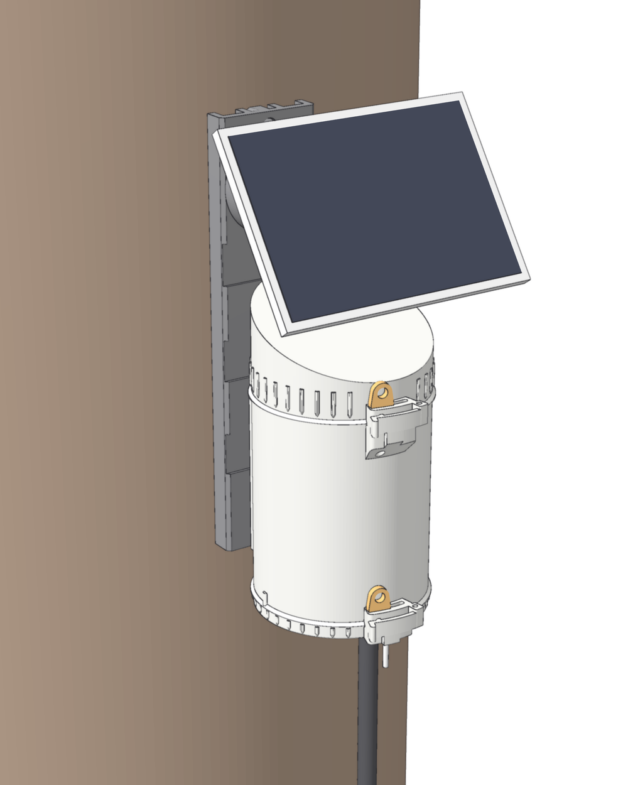</td>
</tr>
<tr>
<td valign="top"><b>Version A.</b> The top stays on the tree and the base screws up into it from below. Build this one for snow country.</td>
<td valign="top"><b>Version B.</b> A tall can stays on the tree and a short lid screws on top. It's easy to get into, but the joint is more exposed, so it's for milder weather.</td>
<td valign="top"><b>Version C.</b> A sleeve stays on the tree. A's base screws into its bottom and B's lid onto its top, so it opens at either end. Milder weather, like B.</td>
</tr>
</table>

> [!IMPORTANT]
> **Check your panel mount before you print the bracket.** The brackets are drawn for a round mount whose three holes are 36 mm apart, center to center. Every file includes a small mount test disc that takes 17 minutes to print. Drop your mount into it and see if the holes line up. If they don't, change one number in the source and export the bracket again. [Changing the design](docs/customizing.md#the-panel-mounts-holes) shows how, including how to measure without calipers.

## Pick a file

There's one file for each version and mount style. Each file holds every printed part for that combination:

- the top (A) or the lid (B and C)
- the base (A and C) or the can (B)
- the sleeve (C)
- the board sled, and nine turn buttons that hold the boards on it
- a lock pin (two for C, which has two joints)
- the bracket
- two thread test rings, a small fit-test bar and a panel-mount test disc
- for B and C with the wing-nut mount, three small spacers that go behind the bolt heads

Click a picture to open that file in GitHub's 3D viewer. To print one, load it in Bambu Studio, right-click it, choose **Split > To objects** and spread the parts over a few plates ([which parts go together](docs/build-guide.md#split-the-file-into-plates)). The [Printing](#printing) section below has times, filament and the pause heights.

<table>
<tr>
<th></th>
<th>Tree-screw mount</th>
<th>Bolt-on mount</th>
<th>Wing-nut mount</th>
</tr>
<tr>
<th>A</th>
<td align="center"><a href="stl/tahoe-repeater-A-tree-screw.stl">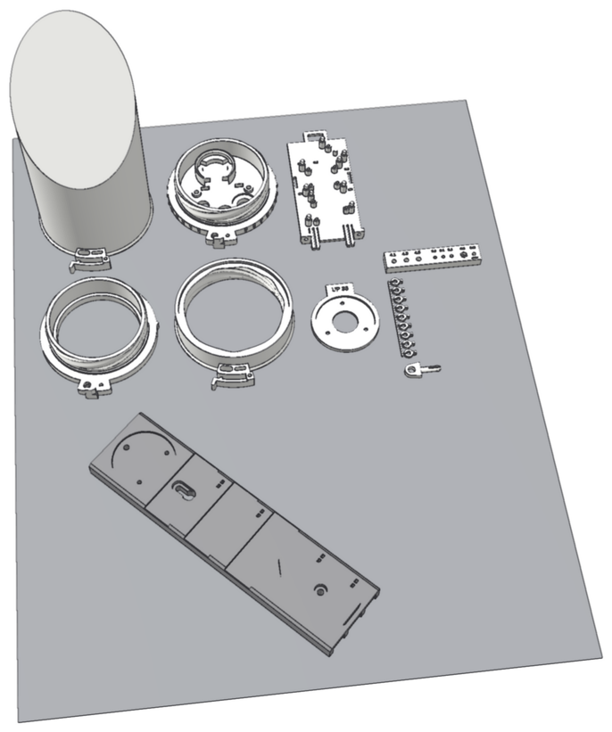</a> <a href="stl/tahoe-repeater-A-tree-screw.stl"><code>tahoe-repeater-A-tree-screw.stl</code></a></td>
<td align="center"> <a href="stl/tahoe-repeater-A-bolt-on.stl"><code>tahoe-repeater-A-bolt-on.stl</code></a></td>
<td align="center"><a href="stl/tahoe-repeater-A-wing-nut.stl">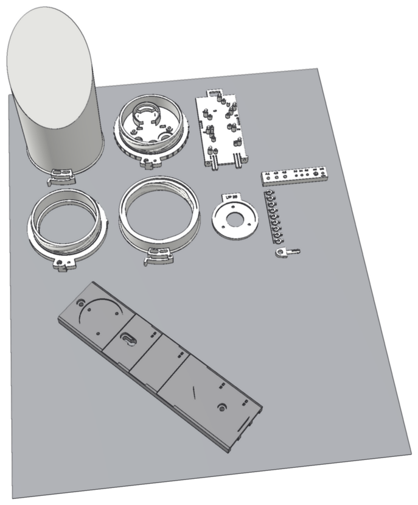</a> <a href="stl/tahoe-repeater-A-wing-nut.stl"><code>tahoe-repeater-A-wing-nut.stl</code></a></td>
</tr>
<tr>
<th>B</th>
<td align="center"><a href="stl/tahoe-repeater-B-tree-screw.stl">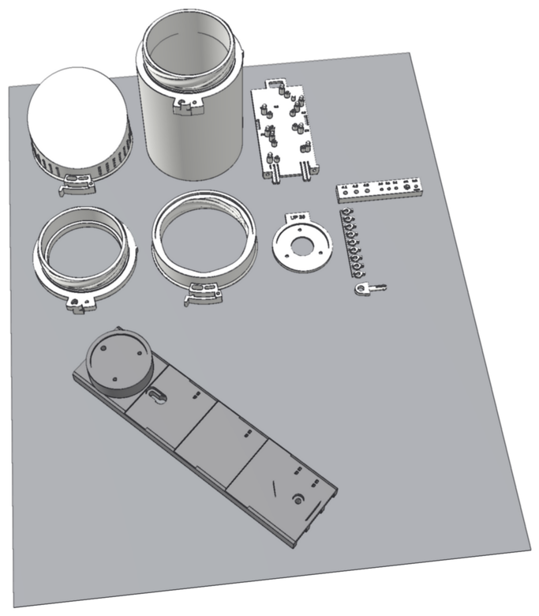</a> <a href="stl/tahoe-repeater-B-tree-screw.stl"><code>tahoe-repeater-B-tree-screw.stl</code></a></td>
<td align="center"> <a href="stl/tahoe-repeater-B-bolt-on.stl"><code>tahoe-repeater-B-bolt-on.stl</code></a></td>
<td align="center"><a href="stl/tahoe-repeater-B-wing-nut.stl">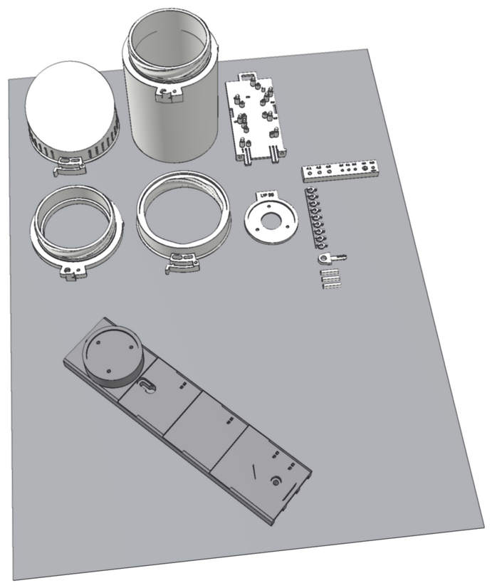</a> <a href="stl/tahoe-repeater-B-wing-nut.stl"><code>tahoe-repeater-B-wing-nut.stl</code></a></td>
</tr>
<tr>
<th>C</th>
<td align="center"><a href="stl/tahoe-repeater-C-tree-screw.stl">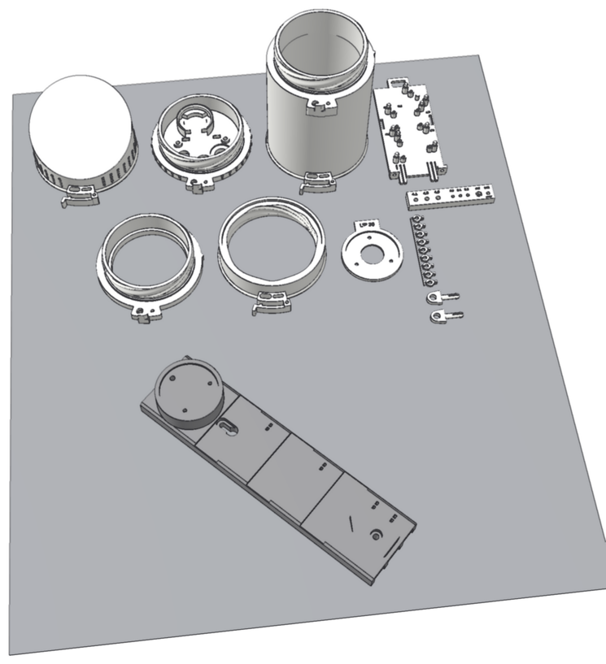</a> <a href="stl/tahoe-repeater-C-tree-screw.stl"><code>tahoe-repeater-C-tree-screw.stl</code></a></td>
<td align="center"><a href="stl/tahoe-repeater-C-bolt-on.stl">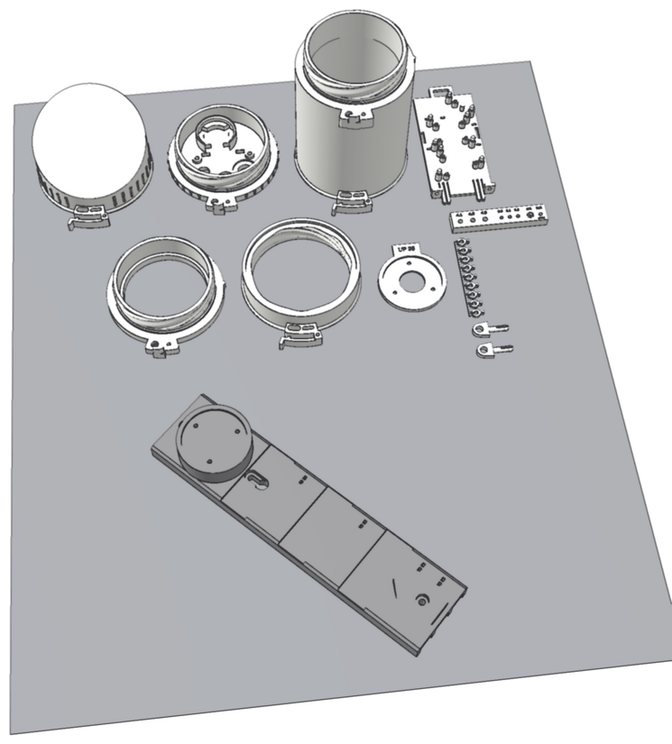</a> <a href="stl/tahoe-repeater-C-bolt-on.stl"><code>tahoe-repeater-C-bolt-on.stl</code></a></td>
<td align="center"><a href="stl/tahoe-repeater-C-wing-nut.stl">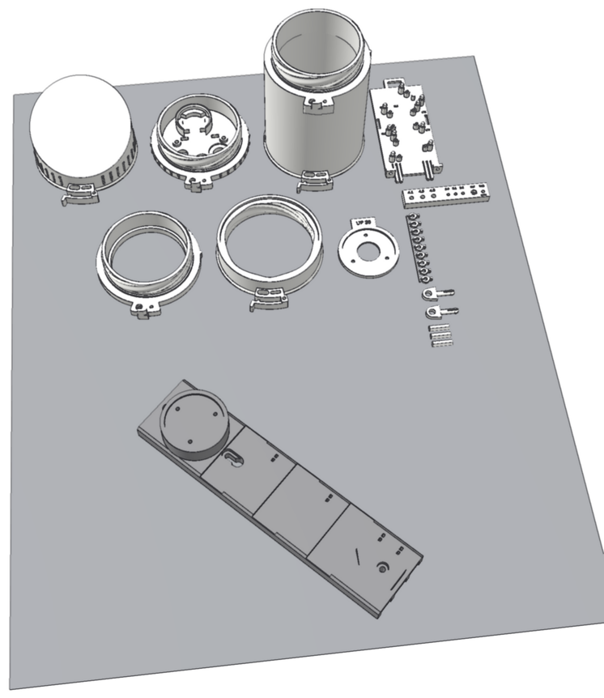</a> <a href="stl/tahoe-repeater-C-wing-nut.stl"><code>tahoe-repeater-C-wing-nut.stl</code></a></td>
</tr>
</table>

Not sure? Start with **A, tree-screw** on your own tree, or **A, bolt-on** if you'll use straps or you'd rather not put a screw through the panel mount.

| Version | Why you'd pick it |
|---|---|
| A | Snow country. Its only joint is at the very bottom, where snow can't sit on it. The electronics all come out underneath together. |
| B | Milder weather, and you want to open it from the top without taking anything down. |
| C | Milder weather, and you want both: the electronics come out the bottom like A's, and the lid comes off the top like B's for a quick look. It has two joints, so there are two O-rings to look after. |

| Mount | Why you'd pick it |
|---|---|
| Tree-screw | The panel mount's top screw goes into the tree, so it's the hardest one to take the panel off. It always needs that one screw, so it can't hang on straps alone. |
| Bolt-on | The panel mount bolts to the bracket with three sealed-in lock nuts, and the bracket has its own screw above the mount. Tree screws, straps or both. |
| Wing-nut | The panel comes off by hand with three wing nuts. For your own property, where easy access matters more than tamper resistance. Tree screws, straps or both. |

## What every file has in common

**Enclosure**

- A round ASA enclosure, 109 mm across, with no holes in its walls or roof. A and B have one joint, and C has two.
- A thread with 8 ridges of different widths, so it only goes together one way and the roof always slopes away from the tree. A small nub shows where to line up the tab before you turn it. About a quarter turn closes it.
- One O-ring (AS568-153, EPDM) per joint. It sits in a groove on the lower part and presses sideways against a smooth bore in the upper part. The thread only holds the parts together, so it turns by hand and stops firmly when the rim meets the flange.
- A drip lip round each joint, so water running down the wall falls clear of it.
- Three ways to lock each joint, all at the front. A built-in latch clicks every time you close it, and a printed pin and an M3 screw are there if you want more. See [Locking it](#locking-it).
- Everything comes in through the floor, facing down: an M12 breather vent, a ¼" cable gland for the panel lead and an SMA bulkhead for the antenna.

**Inside**

- A sled holds the RAK19003 (with the RAK4631), the bq25185 charger and the 5 V boost board. It clicks into the floor and pulls straight up by a handle. There's room for a RAK1901 temperature and humidity sensor under the RAK board.
- Printed turn buttons hold the boards on the sled, so you don't need a screwdriver. M2 screws into heat-set inserts still fit if you'd rather use them.
- A cup holds the 15 Ah cell upright behind the sled, and a hook-and-loop strap holds it to the sled. See [Inside](#inside).

**Bracket**

- A dovetail rail that the enclosure slides down onto.
- Three tree screws in one line down the middle: one inside the rail, one in a keyhole just below the panel mount, and one at the top. Having them all in one line should make it easy to make adapters for posts or poles later.
- The keyhole lets you hang the bracket on one screw before you drive the rest. That screw's head sits in a recess, and the screw inside the rail is hidden once the enclosure is on.
- Three recessed strap channels across the front, low, middle and high, each for a 1" strap. The enclosure slides down over the straps. One strap is extra hold; two or three can replace the tree screws. See [Straps](#straps).
- Zip-tie slots down one side for the panel cable, between the strap channels.
- The panel's round mount sits flat in a pocket. Its screws go into nylon-insert lock nuts sealed inside the bracket, or onto bolts held in the bracket. None of them thread into plastic, and none need thread-locker.

**Printing**

- ASA, and no supports except inside the lid (B and C).
- Two thread test rings, a fit-test bar and a panel-mount test disc, so you can check the thread, the latch, the O-ring, your inserts and nuts, and your panel mount before the long prints.

## What's different

### Version A: fixed top

The top slides down the bracket's rail and stays there. Once the panel mount is on above it, the top can't be lifted off the rail. The base carries the cell, the boards and all three openings. It screws up into the top from below. To open it, pull the latch tab, turn the base about a quarter turn and lower it straight down.

- The joint is at the very bottom of the box. The drip lip throws water running down the walls clear of it, and there's nowhere above it for snow to sit, unlike the joint under B's lid.
- The roof is a single 45° slope, high at the tree, so snow slides off to the front.
- Service happens with the base in your hands, below the box. The top, bracket and panel stay put.

### Version B: fixed can, screw-on lid

The can slides down a shorter rail and holds everything. The lid is short, with a 20° roof. To open it, pull the latch tab, turn the lid about a quarter turn, lift it about a centimetre and slide it out sideways.

- You can look inside and work on it without taking anything down.
- The joint sits near the top, just under a shallow lid where snow can sit and melt, so it sees a lot more water. That's why B is the milder-weather option.
- The panel mount stands out 20 mm on a raised pad so the panel clears the lid coming off. That works with the panel tilted up to about 62°.
- The lid needs supports inside when you print it. Use tree supports, build plate only.
- With the lid off, the can lifts off its rail underneath the panel arm.

### Version C: fixed sleeve, open at both ends

The sleeve slides down B's rail and stays there, like B's can, but it's open at both ends. A's base screws up into its bottom and B's lid screws onto its top. They're the same parts as in A and B, and C uses B's brackets.

- The sled, cell and boards come out the bottom with the base, so you work on them in your hands instead of reaching down into a can.
- The lid comes off the top without disturbing anything else, to check the lights or swap the silica gel.
- It has B's top joint, so it's for the same milder weather as B. Two joints also mean two O-rings to keep greased.
- The sleeve takes a nut near its top during printing, so it needs a pause at 126.8 mm.

### Tree-screw mount

The mount's top hole takes a long wood screw straight through the bracket into the tree, and that doubles as the bracket's top screw. The two lower holes take M3 screws into nylon-insert lock nuts sealed inside the bracket. It's the most tamper-resistant of the three, but it needs a screw in the tree, so you can't hang it on straps alone.

### Bolt-on mount

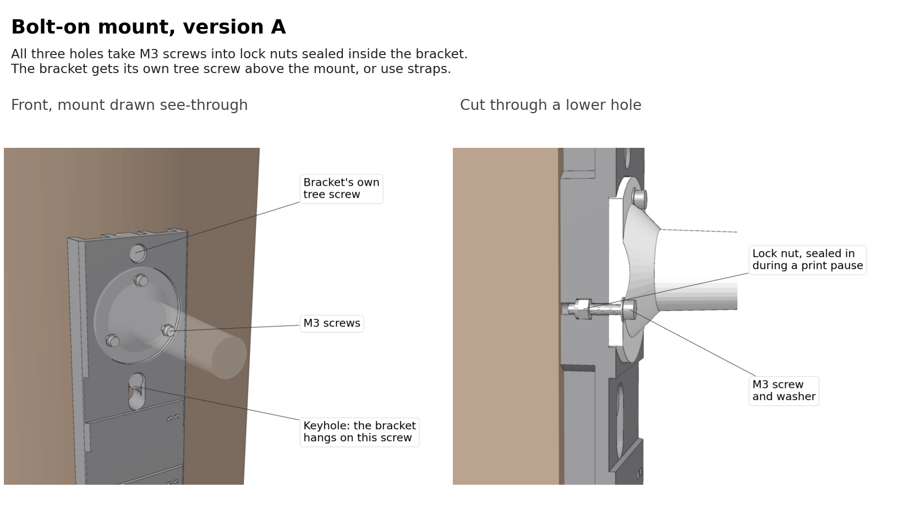

All three holes take M3 screws into lock nuts sealed inside the bracket, so the panel mount doesn't depend on the tree at all. The bracket gets its own screw hole above the mount instead. Use it when the bracket will hang on straps, or if you just don't want a screw through the mount.

### Wing-nut mount

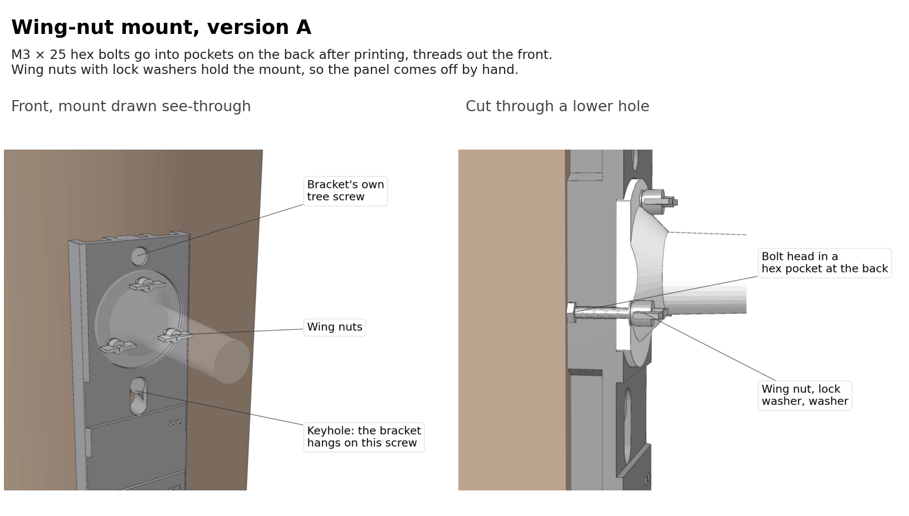

Three M3 × 25 hex bolts push into hex pockets on the back of the bracket after it's printed, with their threads sticking out the front. Nothing gets printed in, so this bracket has no pause. The mount goes over the bolts and three wing nuts hold it, each with a split lock washer and a flat washer under it, so you can take the panel off by hand. The bolt heads are trapped between the bracket and the tree. On B and C, whose pad stands further out, a small printed spacer goes in behind each head. The bracket has its own top screw like the bolt-on. It's meant for private property where you want easy access and aren't worried about other people.

B's brackets, which C uses too, have the same three mount styles on the raised pad: [B tree-screw](images/mount-B-tree.png), [B bolt-on](images/mount-B-bolt.png), [B wing-nut](images/mount-B-wing.png).

## Locking it

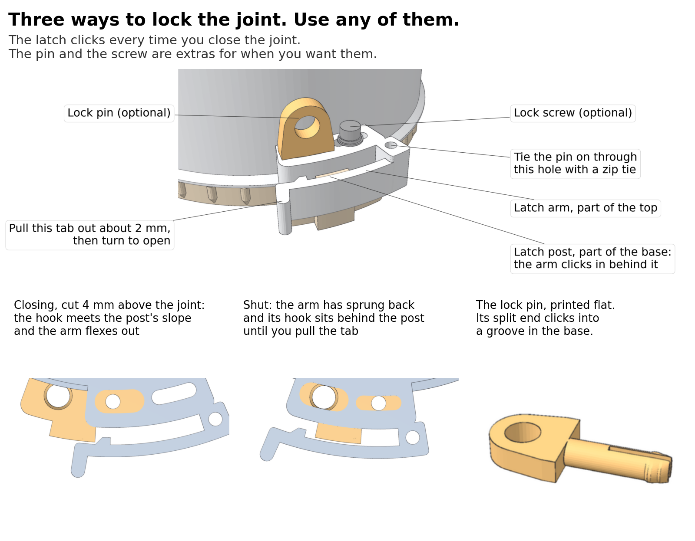

Every joint has three locks at the front, and you can use any of them.

- **Latch.** An arm on the upper part rides over a post on the lower part as the joint closes, then clicks in behind it. It does this every time you close it, so there's nothing to remember. To open, pull the tab on the end of the arm out about 2 mm and turn. The arm lies flat in the print, so it bends along its layers rather than across them, which is the strong way for a printed spring.
- **Lock pin.** A printed pin goes down through both tabs and clicks into a groove in the lower one. A small zip tie through its ring and the hole next to the latch keeps it from getting lost. Use it as well as the latch where someone might fiddle with the box.
- **Lock screw.** An M3 × 20 with a split lock washer, into a nut sealed in the lower tab during printing, as before. It takes a hex key to open, so it's the most tamper-resistant.

The latch, pin and screw all line up where the joint lands when it's hand-tight. Slots in the upper tab take up the last few degrees, so you never have to force the joint round to get the pin or screw in.

## Inside

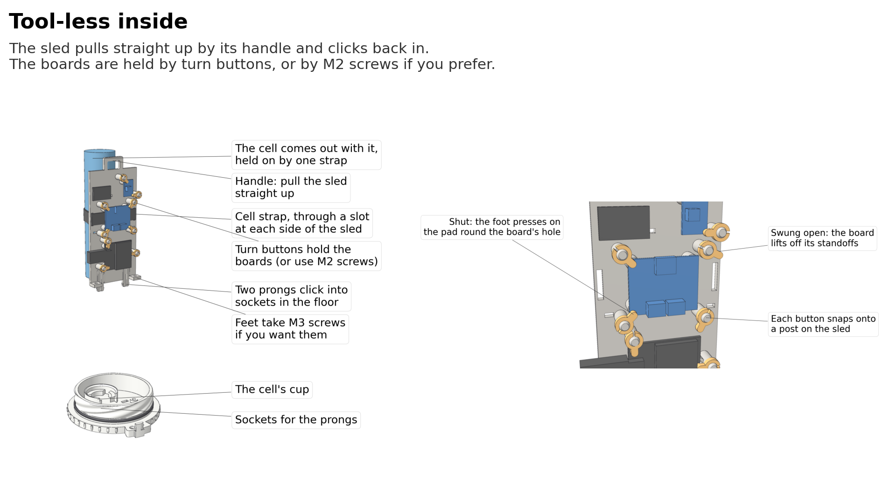

The sled clicks into two sockets in the floor on two sprung prongs. To take it out, unplug the panel lead at the charger and pull the sled straight up by its handle. The cell comes with it, strapped on, because its leads run to the protection board on the sled. With the 20 cm antenna lead from the parts list, you can set the sled down beside the box without unplugging the antenna.

The boards sit on standoffs. Nine printed turn buttons snap onto posts beside them and swing over the pads round each board's mounting holes, so a board comes off with a flick of each button. If you'd rather use screws, the standoffs still take M2 heat-set inserts and M2 × 5 screws. The sled's feet also still take two M3 screws into the floor, if you want it held down harder than the prongs hold it.

## Straps

Every bracket has three strap channels across its front: low, middle and high. Each takes a 1" (25 mm) strap and is recessed 2 mm, so the enclosure still slides down the rail over the strap.

- **One strap** in the middle channel is good extra hold on top of the tree screws, with any of the three mounts.
- **No screws in the tree,** for a tree that isn't yours: use the bolt-on or wing-nut bracket and two straps in the low and high channels, or all three. The tree-screw mount always needs its one screw.
- Use polyester straps with webbing no thicker than 2 mm. Nylon stretches when it's wet. Turn the buckle round to the side of the tree where you can reach it.
- Fit the straps before the enclosure goes on. Snug them again after the first warm spell, check them every season, and let them out a little each year so they don't cut into the growing tree.

The same thing on version B, which C shares: [three channels, one strap and three straps](images/straps-B.png).

## Opening it up

<table>
<tr>
<td width="33%">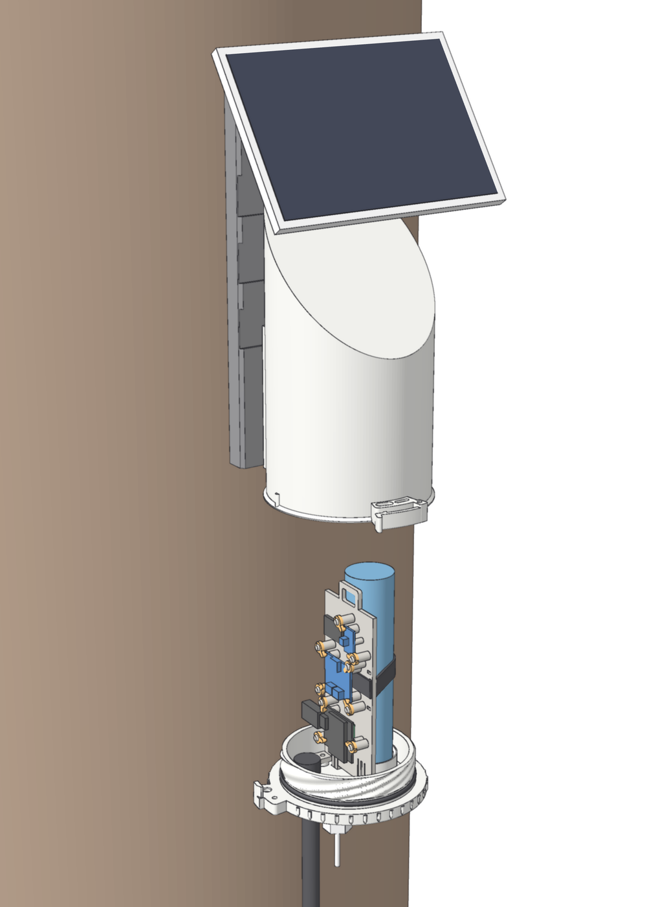</td>
<td width="33%">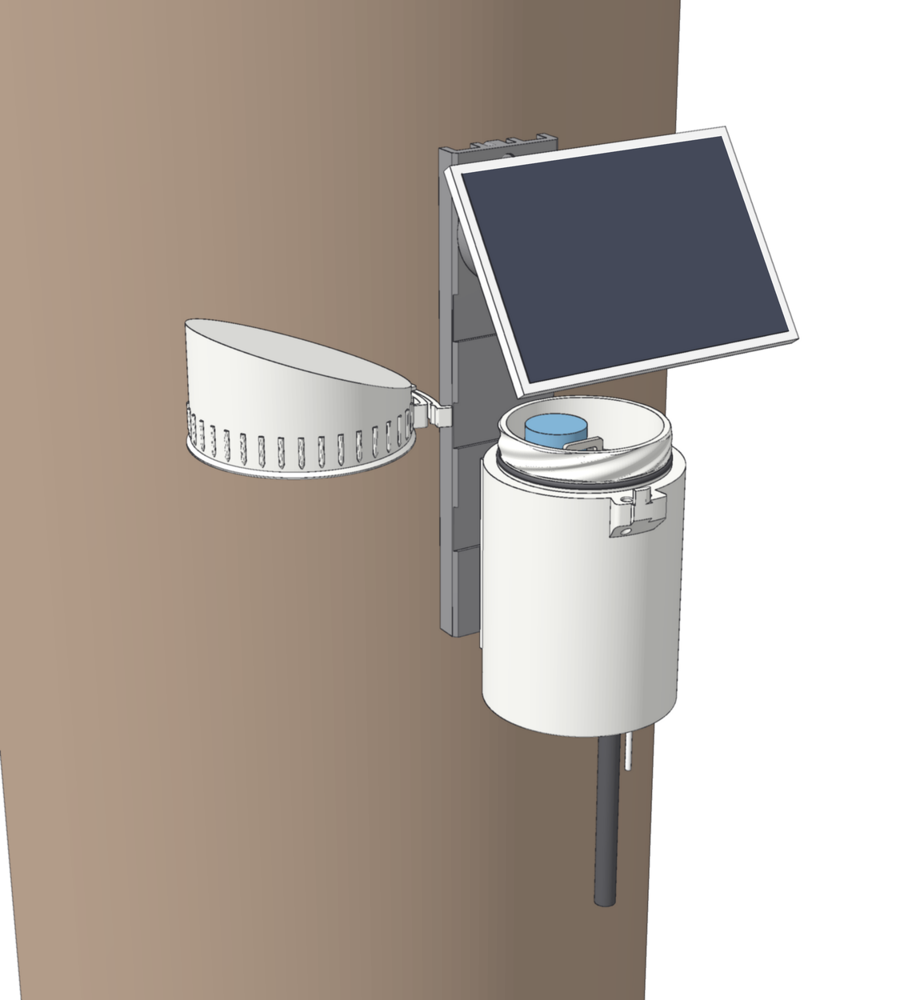</td>
<td width="33%">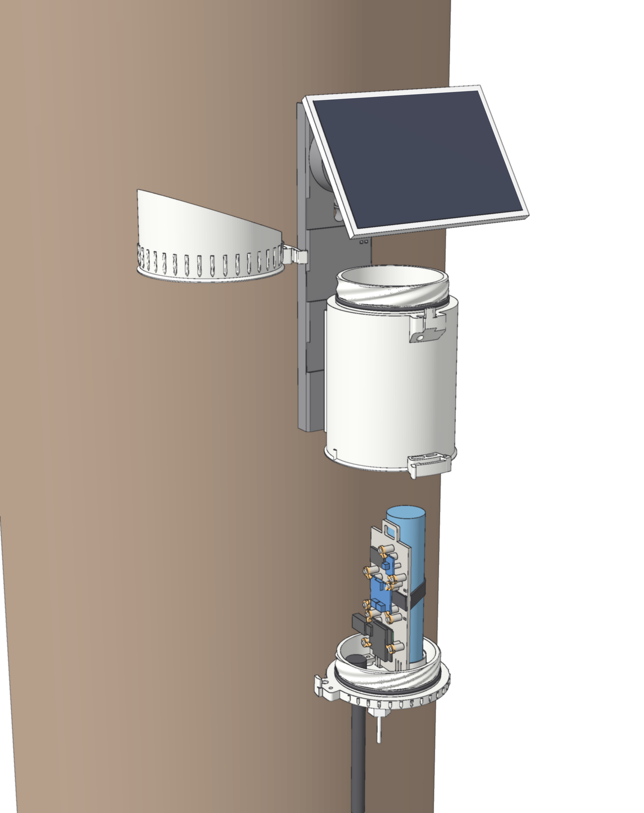</td>
</tr>
<tr>
<td valign="top"><b>A:</b> pull the latch tab, turn the base about a quarter turn and lower it. The cell, boards and sled all come down with it. The panel cable stays connected, so leave some slack in it.</td>
<td valign="top"><b>B:</b> pull the latch tab, turn the lid about a quarter turn, lift it a little and slide it out to the side.</td>
<td valign="top"><b>C:</b> the base comes out the bottom like A's, and the lid comes off the top like B's. Each joint has its own latch.</td>
</tr>
</table>

## How it seals

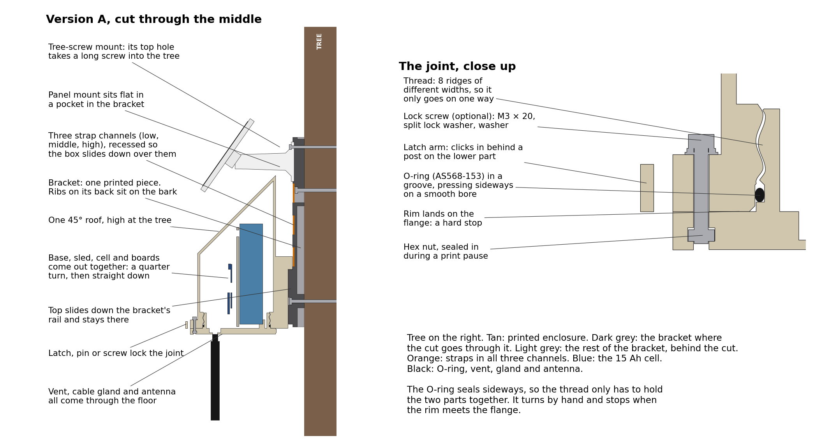

The cut runs down the middle, through the keyhole and between the bracket's ribs, so the bracket is drawn dark where the cut goes through it and light grey behind. It's one printed piece. [Version B's cross-section](images/section-B.png) uses the same joint, higher up, and [version C's](images/section-C.png) has one at each end.

## Printing

Settings: ASA, 0.4 mm nozzle, 0.2 mm layers, 7 walls, 30% gyroid infill, 5 top and 5 bottom layers, with the enclosure door closed. The pause heights below assume 0.2 mm layers, including the first one.

| Part | Time | Filament | Notes |
|---|---|---|---|
| Thread test rings (pair) | 3 h 50 m | 114 g | Print first. They don't need their nut, so no pause |
| Fit-test bar | 40 m | 13 g | Print first |
| Mount test disc | 17 m | 8 g | Print first, to check your panel mount |
| Lock pin | 4 m | 1 g | One per joint |
| A top | 8 h 25 m | 291 g | |
| Base (A and C) | 3 h 5 m | 75 g | **Pause at 4.8 mm** for the lock tab's nut |
| B can | 9 h 30 m | 297 g | **Pause at 134.8 mm** for the lock tab's nut |
| Lid (B and C) | 6 h 15 m | 140 g | Supports inside (tree, build plate only) |
| C sleeve | 8 h 40 m | 277 g | **Pause at 126.8 mm** for the lock tab's nut |
| Sled | 1 h 15 m | 26 g | |
| Turn buttons (all nine) | 6 m | 1 g | |
| Bracket A | 5 h 10 m to 5 h 25 m | 141 to 147 g | **Pause at 9.2 mm** for the lock nuts (tree-screw, bolt-on) |
| Bracket B and C | 6 h 45 m to 7 h 5 m | 175 to 181 g | **Pause at 29.2 mm** for the lock nuts (tree-screw, bolt-on) |

The wing-nut brackets don't need a pause. The times are PrusaSlicer estimates; Bambu Studio on a P1S will give you its own. A full version A comes to about 540 g and 18 hours, B to about 645 g and 24 hours, and C to about 700 g and 26½ hours. The test pieces add about 135 g and 5 hours. One 1 kg spool covers any of them, test pieces included.

The [build guide](docs/build-guide.md#2-print-the-parts) shows how to add the pauses and how to drop the nuts in. The bracket's lock nuts go in nylon side down.

 

## Docs

- **[Parts list](docs/parts-list.md)**: everything to buy, as a checklist by what it's for and again by store, plus [`parts.csv`](docs/parts.csv) to sort and filter in a spreadsheet.
- **[Build guide](docs/build-guide.md)**: printing, the electronics, assembly, mounting it on the tree, flashing MeshCore, service and troubleshooting.
- **[Changing the design](docs/customizing.md)**: the settings worth knowing about in the OpenSCAD source, such as the panel mount's hole spacing, and how to export new STLs.

The source is [`cad/tahoe-repeater.scad`](cad/tahoe-repeater.scad) (OpenSCAD 2021.01 or newer).

## What changed in revision 9

Revision 8 was never published on its own, so this covers everything since revision 7.

- **Tool-less locking.** Every joint has a latch that clicks shut by itself, and a printed lock pin on a tether. The lock screw still fits. The tabs are wider to carry all three.
- **The locks line up where the joint lands.** The thread has a little play, so hand-tight ended a few degrees past where the tabs were drawn lined up. The upper part's thread is now turned 2.5° to allow for that, and the screw and pin sit in slots. The turn from drop-in to closed is about 93° instead of exactly 90°.
- **Tool-less sled.** It clicks into the floor and pulls out by a handle. The two M3 screws that held it down are optional.
- **Turn buttons** hold the boards, and M2 screws are optional.
- **The RAK19003 mounts on its real holes.** Revision 7 had them in the wrong places, so don't print that sled. The board now sits on its two holes and the half-hole at its far edge.
- **One hook-and-loop strap holds the cell,** instead of zip ties. It goes round the middle of the cell, where it can cross the sled clear of every board.
- **Version C,** a new sleeve between A's base and B's lid.
- **Lock nuts in the bracket.** The nuts sealed in the bracket are M3 nylon-insert lock nuts, so the panel mount's screws can't work loose. Their pockets are deeper, and the pause moved to 9.2 mm (A) and 29.2 mm (B and C).
- **A split lock washer under the lock screw.** Its nut sits 1 mm higher to make room, so that pause moved to 4.8 mm (A base) and 134.8 mm (B can).
- **Split lock washers under the wing nuts** too.
- **Three strap channels** spread down the bracket (low, middle, high) instead of two side by side.
- **A panel-mount test disc** in every file.
- **Smaller files.** The thread is drawn in 2° steps instead of 1°, which moves its surface by about 0.01 mm. Every file now opens in GitHub's 3D viewer.

## License

[CC BY-NC-SA 4.0](https://creativecommons.org/licenses/by-nc-sa/4.0/). You're welcome to build it, change it and share it for non-commercial use, as long as you give credit and share your changes under the same license. Selling prints, kits or finished units, or using the design in a paid product or service, needs my written permission first. Open an issue to ask. The full terms are in [LICENSE](../LICENSE).
